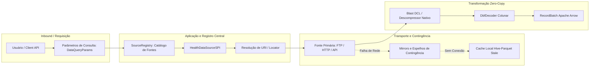

<!--
Copyright (c) 2024-2026 Marcel <MarcelDevBr> and BRHealth Contributors.
Licensed under the GNU Affero General Public License v3 (AGPLv3)
or a commercial license agreement directly with the author.
-->

# Guia Completo da API e Catálogo de Fontes — BRHealth (Agnóstico à Linguagem)

Esta documentação descreve detalhadamente a **API conceitual, o modelo de execução e o catálogo de fontes de dados** do **BRHealth**, de forma **independente de linguagem de programação** (Rust, Python, C/C++, Java, R).

---

## 1. Como Funciona o Acesso às Fontes de Dados

O acesso a dados no BRHealth segue o padrão de arquitetura **Hexagonal Orientada a Dados (Hexagonal DOD)**:



### 1.1. Os Três Modos Universais de Acesso às Fontes

1. **Modo Automático via Catálogo (`fetch`)**:
   Você informa apenas o identificador da fonte (`source_id`), jurisdição federativa (UF ou País) e período temporal (ano/mês). O motor resolve a URL oficial, faz o download com retentativas, gerencia mirrors de contingência e entrega os dados decodificados em formato colunar Apache Arrow.
2. **Modo Acessadores Especializados (*Domain Accessors*)**:
   Interfaces semânticas para domínios específicos de saúde coletiva (ex: `hospital_morbidity`, `vital_statistics`, `demographics`), com parâmetros tipados e opções padrão pré-ajustadas.
3. **Modo Desacoplado / Arquivo Local (`read_dbc` / `read_dbf`)**:
   Para pipelines que já possuem arquivos baixados em disco ou em data lakes locais, sem requisições de rede.

---

## 2. Catálogo Oficial de Fontes Nacionais e Globais

O BRHealth já vem pré-configurado com dois grandes pacotes de fontes: o **Country Pack Brasil (`pack_br`)** e o **Country Pack Global (`pack_global`)**, totalizando mais de 25 fontes oficiais integradas.

### 2.1. Estatísticas Vitais e Assistenciais Nacionais (DATASUS / Ministério da Saúde)

| Identificador (`source_id`) | Nome / Sistema | Tipo de Dado | Resolução Espacial | Temporalidade | Anos Suportados |
| :--- | :--- | :--- | :--- | :--- | :--- |
| **`datasus.sih`** (ou `sih`) | SIH-SUS (RD/AIH) | Morbidade Hospitalar / Internações | Município (IBGE) | Mensal | 1998 a 2026 |
| **`datasus.sim`** (ou `sim`) | SIM-SUS (DO) | Declarações de Óbito e Mortalidade | Município (IBGE) | Anual / Mensal | 1996 a 2026 |
| **`datasus.sinasc`** (ou `sinasc`) | SINASC (DN) | Nascidos Vivos e Condições Perinatais | Município (IBGE) | Anual / Mensal | 1996 a 2026 |
| **`datasus.sinan`** (ou `sinan`) | SINAN | Notificação de Agravos Epidemiológicos | Município (IBGE) | Mensal | 2007 a 2026 |
| **`datasus.sia`** (ou `sia`) | SIA-SUS (PA) | Produção Ambulatorial de Média/Alta Complexidade | Município (IBGE) | Mensal | 2008 a 2026 |
| **`datasus.cnes`** (ou `cnes`) | CNES | Cadastro Nacional de Estabelecimentos e Leitos | Estabelecimento / Município | Mensal | 2005 a 2026 |
| **`datasus.sipni`** (ou `sipni`) | SI-PNI | Imunizações e Cobertura Vacinal | Município (IBGE) | Mensal | 2010 a 2026 |
| **`datasus.sisvan`** (ou `sisvan`) | SISVAN | Vigilância Alimentar e Nutricional | Município (IBGE) | Anual | 2008 a 2026 |
| **`datasus.siscan`** (ou `siscan`) | SISCAN | Vigilância do Câncer (Mama e Colo do Útero) | Município (IBGE) | Anual | 2013 a 2026 |
| **`datasus.bps`** (ou `bps`) | BPS | Banco de Preços em Saúde (Compras Públicas) | Município / Estado | Mensal | 2015 a 2026 |

### 2.2. Demografia, Pesquisas Amostrais e Censitárias (IBGE)

| Identificador (`source_id`) | Nome da Pesquisa | Conteúdo | Granularidade | Periodicidade |
| :--- | :--- | :--- | :--- | :--- |
| **`ibge.censo`** | Censo Demográfico | População residente, pirâmides etárias, setores censitários | Setor Censitário / Município | Decenal (2010, 2022) |
| **`ibge.pnad`** | PNAD Contínua | Condições de moradia, renda domiciliar, escolaridade | Estado / Macrorregião | Trimestral / Anual |
| **`ibge.pof`** | Pesquisa de Orçamentos Familiares | Padrão de consumo, despesa com saúde e nutrição | Estado / Capital | Quinquenal |
| **`ibge.pense`** | PeNSE | Saúde dos Escolares (alimentação, drogas, atividade física) | Município / Estado | Amostral |
| **`ibge.munic`** | Pesquisa MUNIC | Gestão pública municipal e capacidade instalada de saúde | Município (IBGE 7 dígitos) | Anual |

### 2.3. Determinantes Ambientais, Clima e Saneamento

| Identificador (`source_id`) | Entidade Responsável | Conteúdo / Indicador | Granularidade |
| :--- | :--- | :--- | :--- |
| **`environmental.inmet`** | INMET | Estações Meteorológicas (Temperatura, Umidade, Chuva) | Estação / Coordenada |
| **`environmental.bdqueimadas`** | INPE | Focos de Calor e Queimadas via Satélite | Ponto Geográfico (Lat/Lon) |
| **`environmental.prodes`** | INPE | Taxas Anuais de Desmatamento na Amazônia e Cerrado | Município / Polígono |
| **`environmental.sisagua`** | Ministério da Saúde | Vigilância da Qualidade da Água para Consumo Humano | Município / Ponto de Abastecimento |

### 2.4. Proteção e Vulnerabilidade Social (MDS)

| Identificador (`source_id`) | Entidade Responsável | Conteúdo / Indicador | Granularidade |
| :--- | :--- | :--- | :--- |
| **`mds.cadunico`** | Ministério do Desenvolvimento Social | Microdados e contagens do Cadastro Único (famílias vulneráveis) | Município (IBGE) |

### 2.5. Fontes Supranacionais e Globais (Country Pack Global)

| Identificador (`source_id`) | Organização | Conteúdo | Abrangência |
| :--- | :--- | :--- | :--- |
| **`global.who_gho`** | OMS (WHO GHO) | Global Health Observatory (mortalidade infantil, DNTs) | Internacional (Países) |
| **`global.ihme_gbd`** | IHME | Global Burden of Disease (DALYs, YLLs, YLDs por causa) | Subnacional e Global |
| **`global.copernicus_era5`** | ECMWF / Copernicus | Reanálise climática horária/mensal de alta resolução | Grade Global 0.25° |
| **`global.worldpop`** | WorldPop / Univ. Southampton | Distribuição espacial populacional de alta resolução | Grade 100m / 1km |
| **`global.paho_plisa`** | OPAS / PAHO | Plataforma de Informação de Saúde das Américas | Américas |
| **`global.openaq`** | OpenAQ | Monitoramento de qualidade do ar global ($PM_{2.5}$, $PM_{10}$, $O_3$, $NO_2$) | Sensores Pontuais |

---

## 3. Especificação Estruturada dos Parâmetros de Consulta

Para acessar qualquer fonte, o consumidor passa um conjunto padronizado de parâmetros (abstratamente definido como `DataQueryParams`):

```json
{
  "source_id": "datasus.sih",
  "scope": "National",
  "jurisdiction": "SP",
  "year": 2023,
  "month": 5,
  "harmonize_ibge": true,
  "assign_h3_resolution": 8,
  "enrich_csap": true,
  "extra_filters": {
    "tipo_aih": "RD"
  }
}
```

### 3.1. Descrição dos Campos
- **`source_id`** (`String`, obrigatório): Identificador único da fonte (ver tabelas da Seção 2). Aceita pontos ou sublinhados (`"datasus.sih"` ou `"datasus_sih"`).
- **`jurisdiction`** (`String` ou `List<String>`, opcional para fontes globais): Sigla da Unidade da Federação (`"SP"`, `"RJ"`, `"MG"`) ou código do país (`"BRA"`). Quando suportado pela linguagem, aceita lista de estados (`["SP", "RJ"]`).
- **`year`** (`Integer`, obrigatório): Ano de competência dos dados (ex: `2024`).
- **`month`** (`Integer`, opcional): Mês de competência (1 a 12). Se omitido em fontes anuais (como SIM ou SINASC), todo o ano consolidado é recuperado.
- **`harmonize_ibge`** (`Boolean`, padrão: `true`): Se ativo, localiza colunas de municípios e recalcula o Dígito Verificador via Luhn Módulo 10, padronizando de 6 para 7 dígitos canônicos.
- **`assign_h3_resolution`** (`Integer`, opcional: 0 a 15): Se fornecido junto a colunas de coordenadas, indexa as linhas diretamente em células hexagonais Uber H3.
- **`enrich_csap`** (`Boolean`, padrão: `false`): Quando ativado para fontes de morbidade hospitalar (SIH), aplica as regras diagnósticas da **Portaria MS/SAS 221/2008**, injetando colunas de classificação de causas evitáveis.
- **`extra_filters`** (`Map<String, String>`, opcional): Parâmetros adicionais específicos da fonte (ex: tipo de AIH, grupo de doenças, estação).

---

## 4. Exemplos de Uso por Linguagem

### 4.1. Exemplo em Python

```python
import brhealth

# 1. Inicializar o Motor
engine = brhealth.Engine()

# 2. Modo 1: Acesso via Catálogo Geral
batch_sp = engine.fetch(
    source_id="datasus.sih",
    jurisdiction="SP",
    year=2024,
    month=1,
    harmonize_ibge=True,
    enrich_csap=True
)

# 3. Modo 2: Acesso via Acessador Especializado
sih = engine.hospital_morbidity
batch_mg = sih.fetch(jurisdiction="MG", year=2024, month=1)

# 4. Modo 3: Acesso Local a Arquivo Pré-existente
local_batch = brhealth.read_dbc("/caminho/dados/RDSP2401.dbc")

# 5. Zero-Copy para ecossistema de Data Science
df_polars = batch_sp.to_polars()
table_pyarrow = batch_sp.to_arrow()
tensor_torch = batch_sp.to_torch()
```

### 4.2. Exemplo em Rust (`brhealth-core`)

```rust
use std::sync::Arc;
use brhealth_core::domain::application::{BRHealthApplicationService, PipelineExecutionOptions};
use brhealth_core::domain::source_spi::{DataQueryParams, GeographicScope};

#[tokio::main]
async fn main() -> Result<(), Box<dyn std::error::Error>> {
    // 1. Inicializar o Serviço de Aplicação
    let app = BRHealthApplicationService::standard_in_memory()?;

    // 2. Definir parâmetros da consulta
    let params = DataQueryParams {
        scope: GeographicScope::National { iso_3166_alpha3: "BRA".into() },
        jurisdiction_code: Some("SP".into()),
        year: 2024,
        month: Some(1),
        extra_filters: Default::default(),
        as_of_snapshot: None,
    };

    let options = PipelineExecutionOptions {
        harmonize_ibge: true,
        enrich_csap: true,
        ..Default::default()
    };

    // 3. Executar o pipeline analítico completo
    let result = app.execute_full_pipeline("datasus.sih", &params, &options).await?;

    println!("Linhas processadas: {}", result.batches[0].num_rows());
    println!("Manifesto FAIR SHA-256: {:?}", result.manifest.sources[0].raw_sha256);

    Ok(())
}
```

### 4.3. Exemplo em C / C++ (via `brhealth-ffi` / Arrow C Data Interface)

```c
#include "brhealth.h"
#include <stdio.h>

int main() {
    // 1. Descomprimir e decodificar arquivo DBC diretamente para Arrow C Data
    struct ArrowArray array;
    struct ArrowSchema schema;

    int status = brhealth_read_dbc_to_c_arrow(
        "/caminho/RDSP2401.dbc",
        &array,
        &schema
    );

    if (status == 0) {
        printf("Tabela Arrow importada com sucesso! Colunas: %lld, Linhas: %lld\n",
               schema.n_children, array.length);
        
        // Liberar estruturas Arrow C Data após uso
        if (array.release) array.release(&array);
        if (schema.release) schema.release(&schema);
    } else {
        printf("Erro na decodificação do arquivo DBC.\n");
    }
    return 0;
}
```

---

## 5. Como Adicionar Novas Fontes de Dados (Extensibilidade)

O BRHealth oferece dois métodos para cadastrar novas fontes:

### 5.1. Via Definição Declarativa (YAML)
Sem escrever uma única linha de código, crie um arquivo YAML e registre no motor:

```yaml
id: "meu_estado.morbidade"
display_name: "Dados Locais de Internação do Estado X"
maintaining_agency: "Secretaria Estadual de Saúde"
category: "ClinicalMorbidity"
scope:
  type: "Subnational"
  iso_3166_2: "BR-SP"
locator_template: "https://dados.saude.sp.gov.br/internacoes_{year}_{month:02}.csv"
temporal_resolution: "Mensal"
spatial_resolution: "Municipal"
supported_years: [2020, 2026]
```

### 5.2. Via Código (Implementando `HealthDataSourceSPI`)
Para fontes que requerem autenticação, paginação complexa ou decodificadores específicos, basta implementar a interface SPI:
- `metadata(&self) -> SourceMetadata`: Descreve a fonte, agência mantenedora e escopo.
- `resolve_locator(&self, params) -> Result<String>`: Constrói a URL/caminho baseando-se no ano, mês e estado.
- `fetch_and_decode(&self, params, context) -> Result<Vec<RecordBatch>>`: Baixa os bytes brutos usando `context.transport` e transforma em `RecordBatch` Apache Arrow.
- `mirror_uris(&self, params) -> Vec<String>`: Declara servidores espelho para contingência automática caso a URL principal caia.
