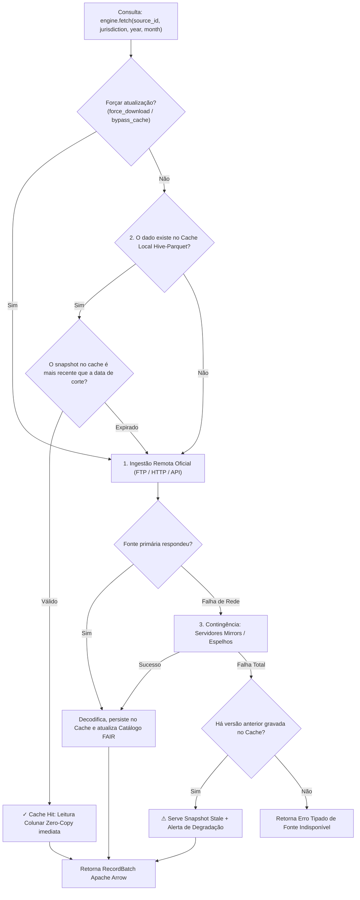

<!--
Copyright (c) 2024-2026 Marcel <MarcelDevBr> and BRHealth Contributors.
Licensed under the GNU Affero General Public License v3 (AGPLv3)
or a commercial license agreement directly with the author.
-->

# Guia Unificado da API e Resolução de Fontes com Cache — BRHealth (Agnóstico à Linguagem)

Esta documentação descreve a **API conceitual, o modelo de resolução transparente de dados e o catálogo de fontes** do **BRHealth**, de forma **independente de linguagem de programação** (Rust, Python, C/C++, Java, R).

---

## 1. Princípio Arquitetural: Interface Única e Transparente

No BRHealth, **o usuário e as bibliotecas clientes interagem com as fontes de dados através de uma interface conceitual idêntica e unificada**, independentemente de onde o dado físico resida. 

O consumidor da API **não precisa e não deve** gerenciar manualmente arquivos locais baixados (`.dbc`, `.dbf`, `.csv`), caminhos temporários no sistema de arquivos ou fluxos de download manuais. 

### 1.1. Resolução em Camadas Gerenciada pelo Core

O núcleo analítico (`core`) intercepta cada requisição e decide de forma transparente:



1. **Transparência Absoluta**: A mesma chamada (`engine.hospital_morbidity.fetch(...)` ou `engine.fetch("datasus.sih", ...)`) funciona offline (se já estiver em cache) ou online (baixando automaticamente na primeira execução).
2. **Localização Canônica de Cache**: O cache particionado não usa diretórios temporários voláteis (como `/tmp`). Ele reside na pasta persistente padrão do usuário (`$HOME/.brhealth/cache` ou variável `BRHEALTH_CACHE_DIR`), particionado por fonte, UF e ano sob o padrão **Hive-Parquet** (`{dataset}/uf={UF}/year={ANO}/snapshot={UUID}/data.parquet`).
3. **Governança de Ciclo de Vida do Cache**: O core oferece operações explícitas para invalidar ou limpar o cache:
   - Limpeza total do cache ou de uma fonte específica.
   - Limpeza seletiva de snapshots mais antigos que uma data ou período especificado (*time-to-live*).
   - Flag de consulta `force_download=True` para contornar o cache e puxar dados atualizados diretamente do órgão emissor.

---

## 2. Operações de Gestão de Cache no Core

O motor disponibiliza um sub-objeto de gerenciamento de cache (`engine.cache` / `CacheManager`):

### 2.1. Métodos Conceituais de Cache

| Operação | Parâmetros | Descrição |
| :--- | :--- | :--- |
| **`clear()`** | `[source_id]` | Remove todos os dados em cache. Se `source_id` for informado, limpa apenas a partição daquela fonte (ex: `"datasus.sih"`). |
| **`clear_older_than()`** | `cutoff_date` ou `days` | Remove snapshots e arquivos de dados cujos carimbos de criação sejam anteriores à data de corte especificada (ex: `days=30` ou `cutoff="2025-01-01"`). |
| **`status()`** | `[source_id]` | Retorna o tamanho total ocupado em disco, contagem de snapshots salvos e intervalo de datas das fontes cacheadas. |
| **`warmup()`** | `source_id`, `jurisdictions`, `years` | Pré-aquece o cache em segundo plano baixando e decodificando previamente os dados solicitados. |

---

## 3. Catálogo Oficial de Fontes de Dados Integradas

O catálogo do BRHealth é pré-carregado no núcleo com mais de 25 fontes prontas para consulta automática:

### 3.1. Estatísticas Vitais e Assistenciais Nacionais (DATASUS / Ministério da Saúde)

| Identificador (`source_id`) | Acessador Semântico | Sistema / Conteúdo | Resolução Espacial | Temporalidade |
| :--- | :--- | :--- | :--- | :--- |
| **`datasus.sih`** | `engine.hospital_morbidity` | SIH-SUS: Internações Hospitalares (AIH Reduzida) | Município (IBGE) | Mensal (1998–2026) |
| **`datasus.sim`** | `engine.vital_statistics` | SIM-SUS: Declarações de Óbito e Mortalidade Geral | Município (IBGE) | Anual/Mensal (1996–2026) |
| **`datasus.sinasc`** | `engine.vital_statistics` | SINASC: Nascidos Vivos e Condições Perinatais | Município (IBGE) | Anual/Mensal (1996–2026) |
| **`datasus.sinan`** | `engine.notifications` | SINAN: Doenças e Agravos de Notificação Compulsória | Município (IBGE) | Mensal (2007–2026) |
| **`datasus.sia`** | `engine.ambulatory` | SIA-SUS: Produção Ambulatorial de Média/Alta Complexidade | Município (IBGE) | Mensal (2008–2026) |
| **`datasus.cnes`** | `engine.ambulatory` | CNES: Estabelecimentos, Leitos e Recursos Físicos | Estabelecimento | Mensal (2005–2026) |
| **`datasus.sipni`** | `engine.vital_statistics` | SI-PNI: Cobertura Vacinal e Imunizações | Município (IBGE) | Mensal (2010–2026) |
| **`datasus.sisvan`** | `engine.demographics` | SISVAN: Vigilância Alimentar e Nutricional | Município (IBGE) | Anual (2008–2026) |
| **`datasus.siscan`** | `engine.ambulatory` | SISCAN: Rastreamento do Câncer de Mama e Colo Uterino | Município (IBGE) | Anual (2013–2026) |
| **`datasus.bps`** | `engine.social` | BPS: Banco de Preços em Saúde (Medicamentos/Insumos) | Estado / Município | Mensal (2015–2026) |

### 3.2. Demografia, Orçamentos e Censo (IBGE)

| Identificador (`source_id`) | Acessador Semântico | Pesquisa / Conteúdo | Periodicidade |
| :--- | :--- | :--- | :--- |
| **`ibge.censo`** | `engine.demographics` | Censo Demográfico: População, idade, sexo, domicílios | Decenal (2010, 2022) |
| **`ibge.pnad`** | `engine.demographics` | PNAD Contínua: Condições socioeconômicas e de trabalho | Trimestral / Anual |
| **`ibge.pof`** | `engine.demographics` | POF: Despesas familiares com saúde e medicamentos | Quinquenal |
| **`ibge.pense`** | `engine.demographics` | PeNSE: Saúde Escolar e Comportamentos de Risco | Amostral |
| **`ibge.munic`** | `engine.demographics` | MUNIC: Estrutura da gestão de saúde nos municípios | Anual |

### 3.3. Clima, Ambiente e Desmatamento

| Identificador (`source_id`) | Acessador Semântico | Órgão / Conteúdo | Granularidade |
| :--- | :--- | :--- | :--- |
| **`environmental.inmet`** | `engine.environmental` | INMET: Estações Meteorológicas (Chuva, Temp, Umidade) | Coordenadas / Estação |
| **`environmental.bdqueimadas`** | `engine.environmental` | INPE: Focos de Calor e Queimadas via Satélite | Ponto Geográfico (Lat/Lon) |
| **`environmental.prodes`** | `engine.environmental` | INPE: Taxas de Desmatamento da Amazônia e Cerrado | Polígono / Município |
| **`environmental.sisagua`** | `engine.environmental` | Ministério da Saúde: Qualidade da Água de Abastecimento | Município |

### 3.4. Proteção Social (MDS)

| Identificador (`source_id`) | Acessador Semântico | Órgão / Conteúdo | Granularidade |
| :--- | :--- | :--- | :--- |
| **`mds.cadunico`** | `engine.social` | MDS: Cadastro Único de Famílias Vulneráveis | Município (IBGE) |

### 3.5. Supranacionais e Globais (Country Pack Global)

| Identificador (`source_id`) | Organização | Conteúdo | Granularidade |
| :--- | :--- | :--- | :--- |
| **`global.who_gho`** | OMS | Global Health Observatory: Indicadores mundiais de saúde | Países |
| **`global.ihme_gbd`** | IHME | Global Burden of Disease: Carga de doença (DALYs/YLLs) | Subnacional e Global |
| **`global.copernicus_era5`** | ECMWF | Copernicus ERA5: Reanálise climática de alta resolução | Grade Global 0.25° |
| **`global.worldpop`** | WorldPop | Grade populacional georreferenciada de alta resolução | Células 100m / 1km |
| **`global.paho_plisa`** | OPAS | Indicadores de saúde pública integrados das Américas | Américas |
| **`global.openaq`** | OpenAQ | Dados globais de poluentes atmosféricos ($PM_{2.5}$, $PM_{10}$, $O_3$) | Sensores / Estações |

---

## 4. Exemplos Conceituais de Uso da API

### 4.1. Consulta Unificada em Python (Com Resolução Automática de Cache)

```python
import brhealth

# 1. Inicializa o motor analítico (resgata o cache padrão em ~/.brhealth/cache)
engine = brhealth.Engine()

# 2. Primeira chamada: o core detecta que não há cache, baixa do DATASUS,
# descompacta via Blast nativo, persiste em Hive-Parquet e retorna RecordBatch
batch_sp = engine.hospital_morbidity.fetch(
    jurisdiction="SP",
    year=2024,
    month=1,
    harmonize_ibge=True  # padroniza municípios para 7 dígitos canônicos
)

# 3. Segunda chamada para os mesmos parâmetros:
# O core lê direto do cache local Hive-Parquet instantaneamente (Zero-Copy)
batch_sp_cached = engine.hospital_morbidity.fetch(
    jurisdiction="SP",
    year=2024,
    month=1
)

# 4. Consulta forçando atualização remota (bypass do cache local)
batch_sp_updated = engine.hospital_morbidity.fetch(
    jurisdiction="SP",
    year=2024,
    month=1,
    force_download=True
)

# 5. Gestão de Cache pelo Core
# Limpar dados com mais de 60 dias de antiguidade:
engine.cache.clear_older_than(days=60)

# Limpar apenas os dados cacheados do SIH:
engine.cache.clear(source_id="datasus.sih")

# 6. Interoperabilidade direta Zero-Copy para Ciência de Dados
df_polars = batch_sp.to_polars()
table_arrow = batch_sp.to_arrow()
tensor_torch = batch_sp.to_torch()
```

### 4.2. Consulta Unificada em Rust (`brhealth-core`)

```rust
use chrono::{Duration, Utc};
use brhealth_core::domain::application::{BRHealthApplicationService, PipelineExecutionOptions};
use brhealth_core::domain::source_spi::{DataQueryParams, GeographicScope};

#[tokio::main]
async fn main() -> Result<(), Box<dyn std::error::Error>> {
    // 1. Instanciar o serviço com o cache gerenciado
    let app = BRHealthApplicationService::standard_in_memory()?;

    // 2. Parâmetros de consulta
    let params = DataQueryParams {
        scope: GeographicScope::National { iso_3166_alpha3: "BRA".into() },
        jurisdiction_code: Some("MG".into()),
        year: 2024,
        month: Some(1),
        extra_filters: Default::default(),
        as_of_snapshot: None, // Ou especificar snapshot temporal UTC
    };

    let options = PipelineExecutionOptions {
        persist_to_cache: true,
        harmonize_ibge: true,
        enrich_csap: true,
        ..Default::default()
    };

    // 3. Execução: resolve cache hit ou baixa automaticamente
    let result = app.execute_full_pipeline("datasus.sih", &params, &options).await?;
    println!("Total de registros: {}", result.batches[0].num_rows());
    println!("Status do dado: {:?}", result.data_freshness); // Fresh ou Stale

    Ok(())
}
```

---

## 5. Estrutura Canônica de Dados e Metadados do Objeto Retornado

Independentemente da fonte consultada, a saída é encapsulada em um contêiner colunar contíguo **Apache Arrow `RecordBatch`**, contendo:

1. **Schema Rigoroso de Tipos**: Tipagem forte (inteiros de 32/64 bits, floats, timestamps, strings UTF-8 ou dicionários categóricos) sem perda de precisão ou truncamento.
2. **Harmonização Territorial Embutida**: Colunas de municípios (`MUNIC_RES`, `MUNIC_MOV`, etc.) padronizadas em 7 dígitos canônicos oficiais do IBGE com DV calculado via Luhn Módulo 10.
3. **Manifesto FAIR W3C PROV-O (`manifest`)**:
   - `raw_sha256`: Hash criptográfico SHA-256 do arquivo original no órgão emissor.
   - `created_at_utc`: Carimbo ISO-8601 exato do processamento.
   - `transformations`: Grafo de operações aplicadas (descompressão Blast, decodificação DBF, CSAP, H3).
