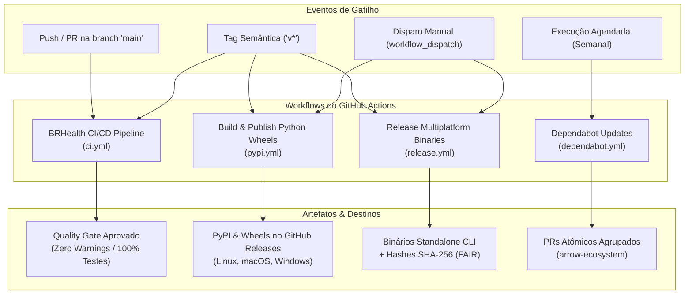

<!--
Copyright (c) 2024-2026 Marcel <MarcelDevBr> and BRHealth Contributors.
Licensed under the GNU Affero General Public License v3 (AGPLv3)
or a commercial license agreement directly with the author.
-->

# Engenharia de CI/CD, Automação e Governança de Releases - BRHealth

Este documento descreve a arquitetura de **Integração Contínua (CI)**, **Entrega Contínua (CD)** e **Governança de Dependências** do projeto **BRHealth**, implementada sobre o **GitHub Actions**.

---

## 1. Visão Geral da Arquitetura de Workflows

O repositório adota a abordagem **Hexagonal Orientada a Dados (Hexagonal DOD)** em um **Monorepo com Cargo Workspace**. Para equilibrar rigor científico máximo e tempos de resposta rápidos para os desenvolvedores, os workflows são particionados em quatro esteiras automatizadas:



---

## 2. Detalhamento dos Workflows e Seus Jobs

### 2.1. BRHealth CI/CD Pipeline (`.github/workflows/ci.yml`)

Este é o **Quality Gate** principal do projeto. É executado em todo `push` ou `pull_request` direcionado à branch `main` (com exceção de modificações exclusivas em documentações e arquivos estáticos).

| Job | Finalidade | Ferramental | Tempo Típico |
| :--- | :--- | :--- | :--- |
| **Formatting & Strict Clippy Gate** | Garante estilo de código padronizado e zero avisos de depreciação ou lint. | `cargo fmt --check`<br>`cargo clippy --workspace --all-targets -- -D warnings` | ~20–35s |
| **Test Suite & Doc-Tests** | Executa testes unitários, testes de integração de 26 fontes, testes baseados em propriedades (*proptest*) e testes de documentação formal. | `cargo test --workspace`<br>`cargo test --workspace --doc` | ~40s (Push)<br>~1m30s (PR) |
| **Python Package & Symbol Sanity** | Compila a extensão nativa C-Python e valida a exportação correta de métodos e símbolos (`Engine`, `read_dbc`, `cache`, etc.). | `maturin build`<br>`pip install *.whl`<br>Smoke tests em Python 3.11 | ~1m20s |
| **Supply Chain Security Audit** | Varre todas as 300+ dependências contra o banco oficial de vulnerabilidades da RustSec. | `taiki-e/install-action@cargo-audit`<br>`cargo audit` | ~9–12s |
| **Benchmarks Compilation Check** | Garante que os micro-benchmarks do Criterion continuam compilando sem quebrar a assinatura dos algoritmos do domínio. | `cargo bench --workspace --no-run` | ~2m |

#### Regra da Matriz Dinâmica de SOs:
- **Pushes na branch `main`**: A suíte de testes executa em `ubuntu-latest` para fornecer feedback em menos de 1 minuto.
- **Pull Requests e Tags de Release**: O pipeline ativa automaticamente a matriz cruzada em **Ubuntu**, **macOS** e **Windows**.

---

### 2.2. Build & Publish Python Wheels (`.github/workflows/pypi.yml`)

Responsável por compilar e disponibilizar a biblioteca para cientistas de dados no ecossistema Python (`pip install brhealth`).

* **Gatilhos**: Criação de tags de versão (`v*`) ou acionamento manual via `workflow_dispatch`.
* **Jobs**:
  1. **Build Wheels (`matrix.target`)**:
     - Compila pacotes nativos `.whl` otimizados para:
       - `x86_64-unknown-linux-gnu` (glibc manylinux)
       - `aarch64-unknown-linux-gnu` (ARM64 manylinux)
       - `aarch64-apple-darwin` (macOS Apple Silicon M1/M2/M3/M4)
       - `x86_64-apple-darwin` (macOS Intel)
       - `x86_64-pc-windows-msvc` (Windows x86_64)
  2. **Build Source Distribution (`sdist`)**:
     - Empacota o código-fonte puro em `.tar.gz` para distribuição Python padrão.
  3. **Publish Wheels to GitHub Releases & PyPI**:
     - Reúne todas as wheels geradas.
     - Anexa ao GitHub Releases.
     - Publica automaticamente no **PyPI** utilizando autenticação segura sem senhas via OpenID Connect (OIDC **Trusted Publishing**).

---

### 2.3. Release Multiplatform Binaries (`.github/workflows/release.yml`)

Compila e distribui os binários da ferramenta de linha de comando (`brhealth-cli`), empacotados com assinaturas criptográficas de acordo com os princípios FAIR.

* **Gatilhos**: Criação de tags de versão (`v*`) ou acionamento manual via `workflow_dispatch`.
* **Jobs**:
  1. **Build (`matrix.target`)**:
     - Produz executáveis nativos standalone para 6 plataformas:
       - `x86_64-unknown-linux-gnu` (glibc)
       - `x86_64-unknown-linux-musl` (100% estático, sem dependência externa de sistema)
       - `aarch64-unknown-linux-gnu` (compilação cruzada via Docker `cross`)
       - `aarch64-apple-darwin` (macOS Apple Silicon)
       - `x86_64-apple-darwin` (macOS Intel)
       - `x86_64-pc-windows-msvc` (Windows executável `.exe`)
     - Compacta em `.tar.gz` (Unix) ou `.zip` (Windows) e calcula o hash criptográfico **SHA-256**.
  2. **Publish GitHub Release**:
     - Gera o manifesto consolidado `SHA256SUMS.txt`.
     - Publica os binários e gera notas de lançamento automatizadas.

---

### 2.4. Governança de Dependências (`.github/dependabot.yml`)

O Dependabot monitora semanalmente as atualizações de dependências no Cargo e nas GitHub Actions.

Para evitar quebras de tipos estritos causadas pelo ecossistema Apache Arrow (onde pacotes como `arrow` e `parquet` devem obrigatoriamente manter a mesma versão principal), o Dependabot é configurado com **agrupamento atômico**:

```yaml
version: 2
updates:
  - package-ecosystem: "cargo"
    directory: "/"
    schedule:
      interval: "weekly"
    open-pull-requests-limit: 10
    groups:
      arrow-ecosystem:
        patterns:
          - "arrow*"
          - "parquet*"
```

---

## 3. Otimizações de Desempenho e Velocidade do CI

Para garantir que o CI seja ágil e não consuma minutos desnecessários, foram aplicadas as seguintes otimizações:

### 3.1. Cancelamento Automático de Builds Concorrentes (`concurrency`)
Ao realizar pushes sequenciais rápidos, builds antigos que ainda estão na fila ou em execução são imediatamente cancelados:
```yaml
concurrency:
  group: ${{ github.workflow }}-${{ github.ref }}
  cancel-in-progress: true
```

### 3.2. Ignorar Alterações Não-Compiláveis (`paths-ignore`)
Commits que modificam apenas documentação, notebooks ou metadados estáticos não acionam os jobs pesados de compilação:
```yaml
paths-ignore:
  - "docs/**"
  - "examples/**"
  - "*.md"
  - "*.ipynb"
  - ".gitignore"
  - "LICENSE"
  - "CITATION.cff"
```

### 3.3. Instalação Instantânea de Binários de Auditoria
A compilação do `cargo install cargo-audit` (que consumia ~1m30s) foi substituída pelo binário oficial pré-compilado via `taiki-e/install-action@cargo-audit`, reduzindo a execução para **9 segundos**.

### 3.4. Gestão de Exceções de Segurança (`.cargo/audit.toml`)
Vulnerabilidades conhecidas em dependências transitivas ou pacotes em transição upstream são formalmente documentadas e controladas através de [`.cargo/audit.toml`](file:///home/marcel/Desenvolvimento/Projetos/brhealth/.cargo/audit.toml), prevenindo falsos-positivos na esteira de CI.

---

## 4. Como Executar os Testes e Lints Localmente

Antes de enviar commits para o GitHub, você pode executar as mesmas validações do CI localmente:

```bash
# 1. Verificar formatação do código
cargo fmt --all --check

# 2. Executar linter estrito (Zero Warnings)
cargo clippy --workspace --all-targets -- -D warnings

# 3. Executar toda a suíte de testes unitários e de integração
cargo test --workspace

# 4. Executar os testes de documentação (doc-tests)
cargo test --workspace --doc

# 5. Validar a compilação dos micro-benchmarks
cargo bench --workspace --no-run
```
