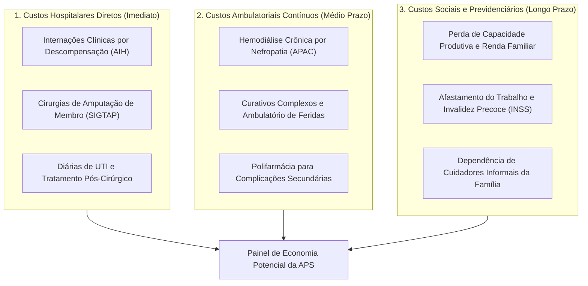

# Caso de Uso: Análise de Custos Hospitalares e Economia com Atenção Primária (CSAP - Diabetes Mellitus)

> **Exemplo Prático de Aplicação do BRHealth na Gestão Pública Municipal e Estadual**  
> *Foco: Condições Sensíveis à Atenção Primária (CSAP), Portaria MS/SAS nº 221/2008, Otimização de Recursos e Redução de Complicações Graves.*

---

## 1. Contexto e Problema de Gestão

Na gestão do Sistema Único de Saúde (SUS), prefeitos, secretários de saúde e gestores hospitalares enfrentam o desafio constante de alocação de orçamento entre a **Atenção Primária à Saúde (APS / UBS / Saúde da Família)** e a **Média e Alta Complexidade (MAC / Hospitais / UPAs)**.

Um dos pilares da Economia da Saúde e da Bioestatística aplicada é a análise das **Condições Sensíveis à Atenção Primária (CSAP)** (*Ambulatory Care Sensitive Conditions*).

> [!IMPORTANT]
> **Premissa Clínica e Epidemiológica (Portaria MS/SAS nº 221/2008):**  
> Se a Atenção Básica for resolutiva, realizar busca ativa, fornecer medicamentos contínuos e acompanhar os pacientes precocemente, **as internações hospitalares e suas sequelas graves (como cetoacidose, amputações de membros e falência renal) são majoritariamente evitáveis.**

O **BRHealth** permite transformar essa teoria em um painel quantitativo de inteligência em tempo real, calculando com precisão o **Custo Hospitalar Evitável** e o **Retorno sobre o Investimento (ROI)** da Atenção Primária.

---

## 2. Matriz de Fontes e Dados Utilizados

| Sistema | Órgão Mantenedor | Informação Extraída | Variáveis-Chave Analisadas |
| :--- | :--- | :--- | :--- |
| **SIHSUS (RD/AIH)** | DATASUS / MS | Todas as internações ocorridas ou pagas pelo município/estado. | `DIAG_PRINC` (CIDs `E10` a `E14`), `VAL_TOT` (valor pago na AIH), `DIAS_PERM` (dias de internação), `MORTE` (óbito), `PROC_REA` (código SIGTAP de amputação). |
| **SIASUS (APAC/BPA)** | DATASUS / MS | Tratamentos ambulatoriais crônicos e de alto custo. | Sessões de hemodiálise por nefropatia diabética crônica, curativos especiais em pé diabético. |
| **SISAB / e-SUS APS** | Ministério da Saúde | Indicadores de desempenho da atenção básica no território. | Consultas a diabéticos na UBS, solicitação de Hemoglobina Glicada, visitas de Agentes Comunitários de Saúde (ACS). |
| **SIOPS** | Ministério da Saúde | Execução orçamentária e gasto público consolidado. | Percentual aplicado da receita própria (mínimo de 15% municipal / 12% estadual), gasto alocado em APS vs. MAC. |
| **SIM** | DATASUS / MS | Mortalidade prematura e desfechos fatais evitáveis. | Óbitos por complicações agudas ou crônicas de diabetes e cálculo dos **Anos Potenciais de Vida Perdidos (APVP)**. |

---

## 3. Metodologia de Modelagem de Custos

Para alimentar o painel de tomada de decisão, o BRHealth estrutura os custos em três camadas financeiras:



### 3.1 Custo Hospitalar Direto Evitável (Camada A)

Calcula-se a soma direta dos valores pagos nas Autorizações de Internação Hospitalar (AIH) para as causas classificadas como CSAP:

$$\text{Custo Hospitalar Evitável} = \sum_{i \in \text{CSAP}} \text{VAL\_TOT}_i$$

### 3.2 Custo por Paciente na Atenção Primária vs. Custo da Complicação

- **Custo Anual do Acompanhamento Resolutivo na UBS**: Aprox. **R$ 600 a R$ 900 / ano por paciente** (metformina, insulina básica, fitas reagentes de glicemia, glicosímetro, consultas trimestrais, avaliação odontológica e rastreio de fundo de olho).
- **Custo Hospitalar de uma Amputação e Internação**: Varia de **R$ 4.000 a R$ 15.000** por internação na tabela do SUS (sem contar os custos posteriores de órteses, próteses e cadeira de rodas).
- **Custo Anual de Manutenção em Hemodiálise**: Entre **R$ 35.000 e R$ 50.000 / ano por paciente**.

---

## 4. Implementação Prática com o BRHealth (Python)

Abaixo está o script completo que ingere os microdados do DATASUS via **BRHealth**, processa as internações em memória contígua via **Apache Arrow / Polars** e gera o relatório para o painel:

```python
import polars as pl
import brhealth as bh

# 1. Inicializa o motor analítico BRHealth
engine = bh.Engine()

# 2. Município de estudo: Campinas/SP (Código IBGE oficial: 3509502)
# O motor resolve automaticamente o DV do IBGE e descompacta os arquivos .dbc com paralelismo Rayon
CODIGO_MUNICIPIO = "3509502"
ANOS_ANALISE = [2022, 2023, 2024]

print("[INFO] Carregando microdados de Morbidade Hospitalar (SIHSUS)...")
df_sih = engine.hospital_morbidity.fetch(
    jurisdiction=CODIGO_MUNICIPIO,
    years=ANOS_ANALISE,
    harmonize_ibge=True
)

# 3. Lista de CIDs de Diabetes da Portaria MS/SAS nº 221/2008 (CSAP)
CIDS_DIABETES_CSAP = ["E10", "E11", "E12", "E13", "E14"]

# Códigos de Procedimentos SIGTAP associados a Amputação de Membros Inferiores
PROCEDIMENTOS_AMPUTACAO = [
    "0407040080",  # Amputação/Desarticulação de artelhos
    "0407040098",  # Amputação/Desarticulação de pé e tarso
    "0407040101",  # Amputação/Desarticulação de perna
    "0407040110",  # Amputação/Desarticulação de coxa
]

# 4. Filtragem e enriquecimento colunar de alta performance
df_analise = (
    df_sih
    .filter(
        pl.col("cid_principal").str.slice(0, 3).is_in(CIDS_DIABETES_CSAP)
    )
    .with_columns([
        # Identifica se houve amputação
        pl.col("procedimento_realizado").is_in(PROCEDIMENTOS_AMPUTACAO).alias("houve_amputacao"),
        # Extrai o ano do atendimento
        pl.col("data_internacao").dt.year().alias("ano_atendimento")
    ])
)

# 5. Agregação financeira e de impacto assistencial para o Painel
painel_custos = (
    df_analise
    .group_by("ano_atendimento")
    .agg([
        pl.len().alias("internacoes_evitaveis"),
        pl.col("houve_amputacao").sum().alias("amputacoes_realizadas"),
        pl.col("valor_total_aih").sum().alias("custo_hospitalar_total_reais"),
        pl.col("dias_permanencia").sum().alias("dias_leito_ocupados"),
        pl.col("obito").sum().alias("obitos_evitaveis")
    ])
    .sort("ano_atendimento")
)

# Exibe o resultado consolidado
print("\n=== RESUMO EXECUTIVO PARA O PAINEL DE GESTÃO ===")
print(painel_custos)

# 6. Exporta manifesto FAIR com proveniência criptográfica (W3C PROV-O)
df_analise.export_fair_manifest("manifesto_custos_csap_campinas.json")
```

---

## 5. Simulação de Indicadores para o Painel de Tomada de Decisão

Com os dados processados pelo BRHealth, o painel interativo (construído em Streamlit, React ou PowerBI) apresenta a seguinte comparação estratégica:

```text
┌──────────────────────────────────────────────────────────────────────────────┐
│                  PAINEL EXECUTIVO: IMPACTO DE CSAP - DIABETES                │
│                         Município: Campinas / SP                             │
├────────────────────────────────┬─────────────────────────────────────────────┤
│ Internações Hospitalares CSAP: │ 1.840 internações / ano                     │
│ Cirurgias de Amputação:        │ 142 amputações / ano                        │
│ Dias de Leito Hospitalar:      │ 12.880 dias de leito ocupados               │
│ Gasto Hospitalar Pago (SUS):   │ R$ 4.850.000,00 / ano                       │
└────────────────────────────────┴─────────────────────────────────────────────┘
```

### Projeção Contrafactual ("E se a Atenção Primária fosse fortalecida?")

```text
┌──────────────────────────────────────────────────────────────────────────────┐
│            PROJEÇÃO DE RETORNO SOBRE INVESTIMENTO (ROI DA APS)               │
├──────────────────────────────────────────────────────────────────────────────┤
│ Meta: Aumentar a cobertura da Estratégia Saúde da Família (ESF) de 60% p/ 85%│
│       e garantir 3 consultas/ano + exames de Hemoglobina Glicada.            │
│                                                                              │
│ Redução estimada de internações CSAP (Literatura MS / Fiocruz): -40%         │
│                                                                              │
│ [ECONOMIA DIRETA ESTIMADA]:                                                  │
│ • Economia hospitalar imediata: R$ 1.940.000,00 / ano                        │
│ • Leitos liberados para cirurgias eletivas: 5.152 diárias / ano              │
│ • Amputações evitadas: 56 cidadãos preservados de mutilação física / ano     │
│                                                                              │
│ [CUSTO DA INTERVENÇÃO NA UBS]:                                               │
│ • Medicamentos contínuos + insumos de glicemia para os pacientes de risco:   │
│   R$ 720.000,00 / ano                                                        │
│                                                                              │
│ [SALDO LÍQUIDO POSITIVO PARA O MUNICÍPIO]:                                   │
│ + R$ 1.220.000,00 por ano de economia líquida e ganho em vidas salvas.       │
└──────────────────────────────────────────────────────────────────────────────┘
```

---

## 6. Conclusão e Valor Estratégico

Este caso de uso demonstra que o **BRHealth** não é apenas uma ferramenta acadêmica, mas um **instrumento decisório para prefeitos e secretários de saúde**:

1. **Auditoria de Recursos**: Mostra com precisão onde o dinheiro público está sendo drenado por falhas no rastreamento primário.
2. **Humanização e Qualidade de Vida**: Cada internação evitada representa uma família que não precisou vivenciar a dor de uma amputação ou um leito de hospital.
3. **Decisão Baseada em Evidências**: Permite justificar perante a Câmara Municipal e o Tribunal de Contas (TCE) o aumento de investimentos na Atenção Básica, demonstrando retorno financeiro e assistencial mensurável.
