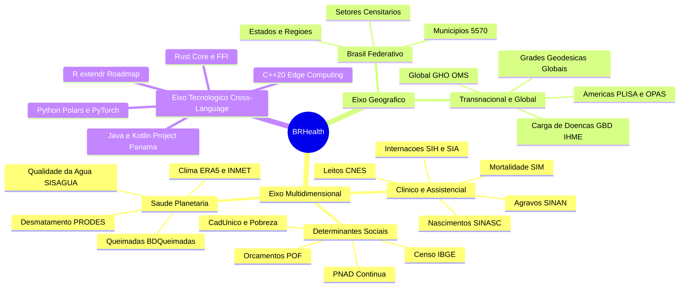
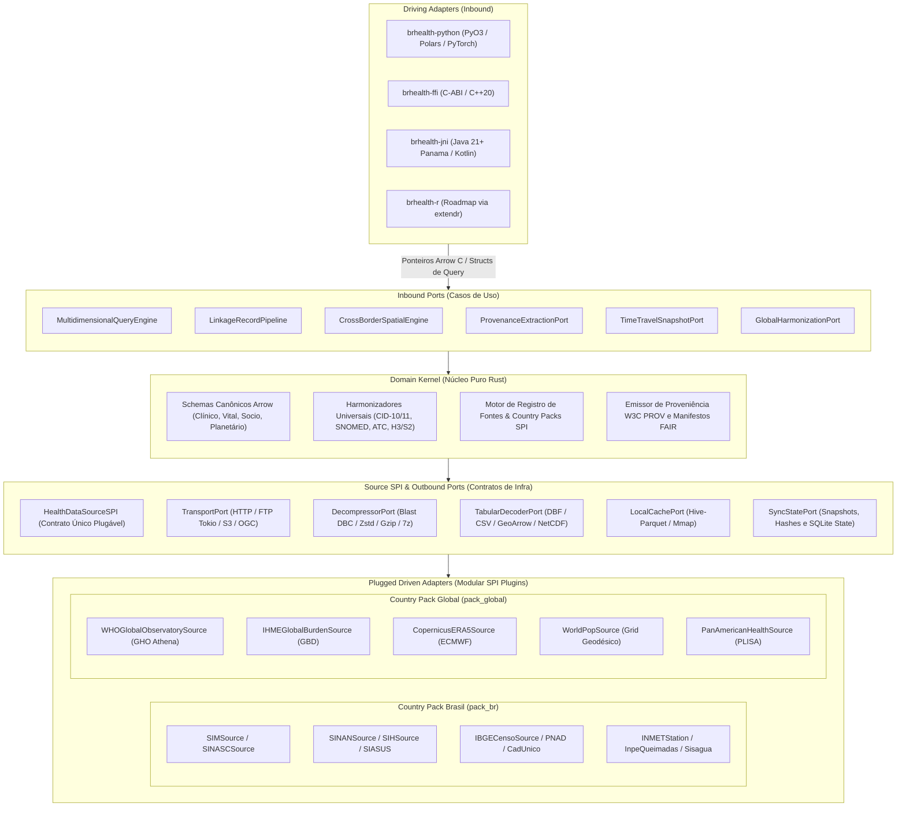
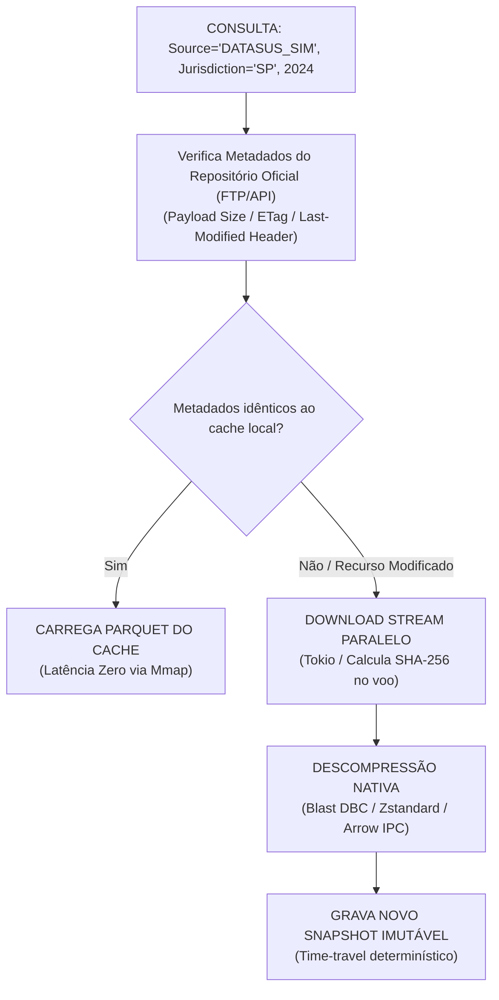

# BRHealth: Motor de Alta Performance para Dados de Saúde Coletiva e Determinantes Sociais do Brasil

> **Documento de Arquitetura de Engenharia de Dados, Bioestatística, Integrações Nativas, Extensibilidade Transnacional e Bindings Cross-Language**

---

## Sumário

1. [Visão Geral e Posicionamento do Projeto](#1-visão-geral-e-posicionamento-do-projeto)
   - [1.1 Premissas Centrais de Engenharia e Rigor Científico](#11-premissas-centrais-de-engenharia-e-rigor-científico)
   - [1.2 Filosofia de Bem Público Digital, Licenciamento AGPLv3 e Modelo de Duplo Licenciamento](#12-filosofia-de-bem-público-digital-licenciamento-agplv3-e-modelo-de-duplo-licenciamento)
2. [Alcance, Utilidade Prática e Proposta de Valor Estratégica](#2-alcance-utilidade-prática-e-proposta-de-valor-estratégica)
   - [2.1 Matriz Comparativa: Status Quo vs. BRHealth](#21-matriz-comparativa-status-quo-vs-brhealth)
   - [2.2 Dimensões de Alcance](#22-dimensões-de-alcance)
   - [2.3 Casos de Uso no Mundo Real](#23-casos-de-uso-no-mundo-real)
   - [2.4 Resiliência de Ingestão e Roadmap de Ecossistemas](#24-resiliência-de-ingestão-e-roadmap-de-ecossistemas)
3. [Arquitetura Hexagonal Orientada a Dados (Hexagonal DOD)](#3-arquitetura-hexagonal-orientada-a-dados-hexagonal-dod)
4. [Matriz de Fontes Multidimensionais](#4-matriz-de-fontes-multidimensionais)
   - [4.1 Módulos Nacionais: Brasil (`pack_br`)](#41-módulos-nacionais-brasil-pack_br)
   - [4.2 Módulos Globais e Transnacionais (`pack_global`)](#42-módulos-globais-e-transnacionais-pack_global)
5. [Desacoplamento Extremo de Fontes: O Padrão HealthDataSourceSPI e Country Packs](#5-desacoplamento-extremo-de-fontes-o-padrão-healthdatasourcespi-e-country-packs)
   - [5.1 Interface de Provedor de Serviço (SPI)](#51-interface-de-provedor-de-serviço-spi)
   - [5.2 Registro de Fontes e Gerenciador de Country Packs](#52-registro-de-fontes-e-gerenciador-de-country-packs)
   - [5.3 Manifesto Declarativo: Fonte Internacional (Exemplo WHO GHO)](#53-manifesto-declarativo-fonte-internacional-exemplo-who-global-health-observatory)
6. [Schemas Canônicos e Harmonização Global](#6-schemas-canônicos-e-harmonização-global)
7. [Governança Científica, Reprodutibilidade e Padrões FAIR](#7-governança-científica-reprodutibilidade-e-padrões-fair)
   - [7.1 Manifesto Criptográfico de Linhagem de Dados (W3C PROV-O)](#71-manifesto-criptográfico-de-linhagem-de-dados-w3c-prov-o)
8. [Harmonização Ontológica e Normalização Semântica](#8-harmonização-ontológica-e-normalização-semântica)
   - [8.1 Reconciliação do Código de Municípios do IBGE (6 vs. 7 Dígitos com DV Módulo 10)](#81-reconciliação-do-código-de-municípios-do-ibge-6-vs-7-dígitos-com-dv-módulo-10)
   - [8.2 Indexação Espacial Discreta Global (H3 & S2)](#82-indexação-espacial-discreta-global-h3--s2)
   - [8.3 Mapeamento Universal de Ontologias Médicas (CID-10, CID-11 e SNOMED-CT)](#83-mapeamento-universal-de-ontologias-médicas-cid-10-cid-11-e-snomed-ct)
9. [Estratégia de Sincronismo, Snapshots e Retificações](#9-estratégia-de-sincronismo-snapshots-e-retificações)
   - [9.1 Time-Travel Científico e Snapshots Imutáveis](#91-time-travel-científico-e-snapshots-imutáveis)
10. [Arquitetura do Workspace Cargo](#10-arquitetura-do-workspace-cargo)
11. [Implementações de Desempenho Crítico](#11-implementações-de-desempenho-crítico)
    - [11.1 Descompressor Blast Nativo em Rust (PKWARE DCL / .dbc DATASUS)](#111-descompressor-blast-nativo-em-rust-pkware-dcl--dbc-datasus)
    - [11.2 Ponte Zero-Copy Arrow C Data Interface](#112-ponte-zero-copy-arrow-c-data-interface)
12. [Exemplos de Consumo Multilíngue em Pesquisa e IA](#12-exemplos-de-consumo-multilíngue-em-pesquisa-e-ia)
    - [12.1 Python: Cruzamento de Dados Locais com Reanálise Climática e ML (Zero-Copy com Polars e PyTorch via DLPack)](#121-python-cruzamento-de-dados-locais-com-reanálise-climática-global-era5-e-ml)
    - [12.2 C++20: Processamento de Alto Desempenho e Borda](#122-c20-processamento-de-alto-desempenho-e-borda)
    - [12.3 Kotlin e Java 21+: Interoperabilidade com Project Panama (FFM API)](#123-kotlin-e-java-21-interoperabilidade-com-project-panama-ffm-api)
13. [Governança, Autoria, Licenciamento e Citação Científica](#13-governança-autoria-licenciamento-e-citação-científica)
    - [13.1 Autoria e Identificador de Citação (`CITATION.cff`)](#131-autoria-e-identificador-de-citação-citationcff)
    - [13.2 Registro de Pacotes nos Ecossistemas Oficiais e Duplo Licenciamento](#132-registro-de-pacotes-nos-ecossistemas-oficiais-e-duplo-licenciamento)
    - [13.3 Validade Jurídica da AGPLv3, Proteção contra Uso Irregular e Remédios Legais](#133-validade-jurídica-da-agplv3-proteção-contra-uso-irregular-e-remédios-legais)

---

## 1. Visão Geral e Posicionamento do Projeto

O **BRHealth (`brhealth`)** é um motor analítico colunar de alta performance implementado em **Rust**, concebido para ingestão, decodificação, transformação, harmonização e análise de altíssima taxa de transferência (*high-throughput*) de dados:
- **Epidemiológicos e Clínicos** (mortalidade, natalidade, morbidade hospitalar, vigilância de agravos);
- **Assistenciais e Farmacêuticos** (produção ambulatorial, redes de atenção, estoques e compras de medicamentos);
- **Demográficos e Socioeconômicos** (censos, amostras domiciliares, vulnerabilidade social, cadastro único);
- **Ambientais e Climáticos** (reanálises meteorológicas, desmatamento, queimadas, saneamento básico).

Embora concebido e otimizado com cobertura inicial exaustiva para o ecossistema federativo do Brasil (**DATASUS**, **IBGE**, **INPE**, **INMET**), o projeto adota uma arquitetura de domínio agnóstica a jurisdições (**Country-Pack Agnostic Architecture**).

O motor atua como fundação técnica para estudos de **Saúde Global** (*Global Health*) e **Saúde Planetária** (*Planetary Health*), permitindo a inclusão progressiva de dados de outros países (América Latina, EUA, Europa) e repositórios supranacionais (**OMS**, **IHME**, **Copernicus**, **WorldPop**).

> [!IMPORTANT]
> O projeto foi concebido para atender às exigências de rigor e reprodutibilidade de pesquisas científicas de alto impacto (*The Lancet Global Health*, *Nature Medicine*, *Cadernos de Saúde Pública*, *Revista de Saúde Pública*), além de vigilância epidemiológica transfronteiriça em tempo real e treinamento de modelos fundacionais de inteligência artificial em saúde.

---

### 1.1 Premissas Centrais de Engenharia e Rigor Científico

1. **Performance Brutal e Zero-Copy (Memória Contígua Arrow)**:
   - Toda representação de dados em memória reside em buffers contíguos alinhados a 64 bytes conforme o padrão **Apache Arrow**.
   - A comunicação com linguagens hospedeiras (Python, C++20, Java 21+, Kotlin, R) ocorre estritamente via **Arrow C Data Interface** e **DLPack**, transferindo ponteiros C padronizados sem cópias de memória (*Zero-Copy*) e sem serializações intermediárias em JSON, CSV ou Protobuf.

2. **Agnóstico a Linguagem e Execução Standalone**:
   - O núcleo é compilado como uma biblioteca dinâmica/estática nativa em Rust (`brhealth-core`).
   - Expõe uma C-ABI plana e estável (`brhealth-ffi`), bindings idiomáticos para CPython (`brhealth-python` via PyO3, integrando com Polars, PyTorch e DuckDB), headers modernos para C++20, e módulos FFM API / Project Panama para Java 21+ e Kotlin no ecossistema JVM.

3. **Paralelismo Seguro e Pipelining sem Lock**:
   - A descompressão binária de formatos legados (algoritmo PKWARE DCL / Blast do DATASUS para arquivos `.dbc`), o parsing colunar de tabelas DBF/CSV e as validações de schemas executam em pools de threads paralelos com **Rayon**.
   - As rotinas de I/O de rede (FTP assíncrono, HTTP streaming, S3, OGC API) operam de forma totalmente não bloqueante com **Tokio**.

4. **Princípios FAIR e Proveniência Estrita (W3C PROV-O)**:
   - Garante reprodutibilidade científica absoluta. Cada extração ou agregação emite um grafo de linhagem criptográfica com hashes **SHA-256** dos dados brutos consumidos, carimbos temporais de acesso aos servidores governamentais e internacionais, árvores de transformações aplicadas e identificadores de versão de ontologias (CID, SNOMED-CT, SIGTAP, IBGE, ISO 3166).

5. **Harmonização Semântica e Ontológica Automática**:
   - **Códigos Municipais**: Conversão de códigos de municípios do IBGE de 6 para 7 dígitos mediante o algoritmo canônico oficial de **Dígito Verificador em Módulo 10 (pesos alternados 1 e 2)** e acomodação de municípios desmembrados ou renomeados entre 1970 e 2026.
   - **Espacial Global**: Suporte a esquemas espaciais transnacionais: ISO 3166-1 alfa-2/3 (países), ISO 3166-2 (subdivisões estaduais/provinciais) e indexação discreta global **H3** (Uber H3 Index) e **S2 Geometry** para dados em grade (*gridded data*).
   - **Classificações Médicas**: Mapeamento ortogonal entre revisões: CID-9, CID-10, CID-11 e SNOMED-CT.
   - **Procedimentos e Fármacos**: Padronização de procedimentos assistenciais (SIGTAP para o Brasil; CPT/ICD-10-PCS para bases internacionais); Classificação Anatômica Terapêutica Química (ATC) e RxNorm para compras públicas e dispensação de fármacos.

6. **Desacoplamento Extremo de Fontes (Pluggable SPI, Regional Packs & Declarative Manifests)**:
   - Nenhuma fonte de dados ou regra nacional é codificada de forma rígida (*hardcoded*) no fluxo analítico central.
   - Cada fonte é um componente autônomo registrado dinamicamente através do padrão de Plugin / Provedor de Serviço (**SPI**) e orquestrado por manifestos declarativos versionados ou pacotes regionais (*Country Packs*).

---

### 1.2 Filosofia de Bem Público Digital, Licenciamento AGPLv3 e Modelo de Duplo Licenciamento

O BRHealth foi fundado sob a premissa de ser um **Bem Público Digital (*Digital Public Good*)**, aberto, transparente e irrestrito para o avanço da ciência e da saúde coletiva, ao mesmo tempo em que protege o trabalho do seu criador contra apropriação predatória corporativa:

- **Acesso Democrático e Universal (100% Gratuito para a Sociedade)**:
  - Estudantes, pesquisadores, universidades, prefeituras, hospitais do SUS e instituições filantrópicas têm acesso irrestrito e gratuito ao código-fonte e binários.
- **Licenciamento Principal: GNU Affero General Public License v3 (AGPLv3)**:
  - Adota a licença **AGPLv3**, o padrão ouro de proteção para softwares executados em rede e em nuvem (*Network Copyleft*).
  - **Reciprocidade Estrita contra o "Fechamento" de Código**: Qualquer entidade ou empresa que utilize, modifique ou disponibilize o BRHealth via rede/serviço (SaaS) **é obrigada por lei a disponibilizar 100% do código-fonte das melhorias e sistemas derivados sob a mesma licença AGPLv3**. Isso impede que grandes corporações privatizem o esforço comunitário sem devolver nada à sociedade.
- **Opção de Licenciamento Comercial Alternativo (*Dual-Licensing*)**:
  - Empresas privadas que desejem embutir o BRHealth em softwares proprietários comerciais fechados (sem a obrigação de abrir o código-fonte da sua aplicação) podem adquirir uma **Licença Comercial Proprietária** diretamente do autor e detentor dos direitos autorais (**Marcel / MarcelDevBr**).
  - Esse modelo híbrido equilibra o impacto social máximo com a sustentabilidade financeira justa do criador.
- **Cláusula de Proteção Autoral Inalienável**:
  - Tanto sob a AGPLv3 quanto em licenças comerciais, o aviso de direitos autorais original é juridicamente perpétuo:
    ```text
    Copyright (c) 2024-2026 Marcel <MarcelDevBr> and BRHealth Contributors.
    ```
- **Citação Científica e Identificação Internacional (DOI)**:
  - Pesquisadores que utilizarem o BRHealth devem citar a autoria original conforme especificado no arquivo [`CITATION.cff`](file:///home/marcel/Desenvolvimento/Projetos/brhealth/CITATION.cff) e no registro permanente **DOI** (Zenodo/CERN).

---

## 2. Alcance, Utilidade Prática e Proposta de Valor Estratégica

### 2.1 Matriz Comparativa: Status Quo vs. BRHealth

O ecossistema tradicional de análise de dados de saúde no Brasil e na América Latina é caracterizado por scripts pontuais, ferramentas legadas e alto atrito técnico. O BRHealth redefine esse paradigma:

| Desafio / Dor Real | Status Quo Atual (Legado) | Solução Estrutural com BRHealth |
| :--- | :--- | :--- |
| **Formatos legados e compressão proprietária** | Arquivos `.dbc` (PKWARE DCL) exigem dependências externas legadas em C (`dbc2dbf`), propensas a falhas de compilação, vulnerabilidades de memória e sem suporte a threads. | **Descompressor PKWARE DCL nativo em Rust** executando em memória pura, sem binários externos, paralelizado com Rayon e com proteção de limites de buffer (*safe memory*). |
| **Gargalos severos de memória RAM** | Bibliotecas em R/Python convertem tabelas inteiras para `data.frame` ou Pandas, estourando a memória física em coortes multi-anuais ou agregações nacionais. | **Layout colunar Apache Arrow contíguo em batches**, permitindo streaming e operações *Zero-Copy* com Polars, DuckDB e PyTorch. |
| **Reconciliação territorial histórica** | Municípios desmembrados e a omissão do 7º dígito verificador do IBGE no DATASUS geram joins inconsistentes e perda de registros. | **Harmonizador vetorial SIMD** que recalcula o DV via Módulo 10 oficial e resolve tabelas de equivalência territorial entre 1970 e 2026. |
| **Cruzamento de Saúde com Clima e Ambiente** | Intersecções poligonais GIS pesadas (via Shapefile) tornam inviável correlacionar milhões de notificações com grades climáticas. | **Indexação espacial discreta em células Uber H3 e S2**: substitui polígonos pesados por chaves inteiras `uint64` em milissegundos. |
| **Reprodutibilidade científica e auditoria** | Bases governamentais sofrem retificações tardias frequentes sem versionamento explícito, impossibilitando reproduzir achados exatos. | **Snapshots imutáveis (Time-Travel)** acompanhados de **Manifestos FAIR criptográficos (W3C PROV-O com SHA-256)** para submissão em periódicos. |

---

### 2.2 Dimensões de Alcance



---

### 2.3 Casos de Uso no Mundo Real

1. **Pesquisa Acadêmica e Epidemiológica de Alto Impacto**:
   - Criação de coortes ecológicas e séries temporais de 20+ anos de mortalidade (SIM) cruzadas com anomalias de temperatura (ERA5) e poluição por queimadas ($PM_{2.5}$) em minutos, gerando o manifesto FAIR exigido por periódicos como *The Lancet* e *Nature*.
2. **Vigilância Epidemiológica e Sala de Situação em Tempo Real (SUS / Municípios / OPAS)**:
   - Detecção antecipada de surtos de arboviroses (Dengue, Chikungunya, Zika, Oropouche) ao correlacionar notificações parciais com anomalias de precipitação e calor em células H3 de resolução fina.
3. **Economia da Saúde e Auditoria de Gastos Evitáveis (CSAP)**:
   - Identificação de custos hospitalares gerados por falhas na atenção básica (como internações e amputações por Diabetes Mellitus descompensado), demonstrando o **Retorno sobre o Investimento (ROI)** da Atenção Primária.
   - *Consulte o caso de uso detalhado e script completo em: [exemplo_analise_custos_csap.md](file:///home/marcel/Desenvolvimento/Projetos/brhealth/exemplo_analise_custos_csap.md).*
4. **Alimentação de Modelos Fundacionais de Inteligência Artificial em Saúde**:
   - Ingestão contínua de milhões de registros hospitalares e ambulatoriais diretamente para tensores PyTorch via Arrow C Data Interface / DLPack sem sobrecarga de serialização.

---

### 2.4 Resiliência de Ingestão e Roadmap de Ecossistemas

> [!TIP]
> **Garantias Operacionais de Engenharia:**
> - **Resiliência contra Instabilidades Governamentais**: Os servidores FTP/HTTP do DATASUS apresentam instabilidade crônica. O subsistema `infrastructure/ftp_client.rs` e `http_client.rs` implementa pools assíncronos com **Tokio**, reconexões automáticas, *exponential backoff*, validação de hashes no voo (*stream hashing*) e cache local via memória mapeada (*Mmap*).
> - **Roadmap para o Ecossistema R**: Como parcela expressiva da comunidade bioestatística global utiliza R, o roadmap do BRHealth contempla a criação do pacote `brhealth-r` via `extendr`, permitindo intercâmbio Zero-Copy direto com pacotes como `arrow`, `data.table` e `targets`.

---

## 3. Arquitetura Hexagonal Orientada a Dados (Hexagonal DOD)

Para manter separação arquitetural estrita sem sacrificar alinhamento de memória e vetorização SIMD (AVX-512 / ARM Neon), o motor adota a **Arquitetura Hexagonal Orientada a Dados (Hexagonal Data-Oriented Design)** combinada com um Registro Desacoplado de Provedores de Dados e Perfis Regionais.



---

## 4. Matriz de Fontes Multidimensionais

### 4.1 Módulos Nacionais: Brasil (`pack_br`)

| Dimensão Temática | Sistema / Pesquisa | Órgão Mantenedor | Granularidade / Frequência | Relevância e Aplicação Científica |
| :--- | :--- | :--- | :--- | :--- |
| **Mortalidade** | SIM | DATASUS / MS | Individual / Mensal e Anual | Séries de causas de morte, APVP, transição epidemiológica. |
| **Natalidade e Gestação** | SINASC | DATASUS / MS | Individual / Mensal e Anual | Baixo peso, prematuridade, cesarianas, idade materna e disparidades. |
| **Vigilância Epidemiológica** | SINAN | DATASUS / MS | Individual / Semanal e Anual | Dinâmica de transmissão de arboviroses, Tuberculose, Hanseníase, Violências. |
| **Morbidade Hospitalar** | SIHSUS (RD/AIH) | DATASUS / MS | Internação / Mensal | Custos, taxas de ocupação, letalidade intra-hospitalar. |
| **Produção Ambulatorial** | SIASUS (PA, APAC, RAAS) | DATASUS / MS | Procedimento / Mensal | Quimioterapia, diálise, saúde mental (CAPS), medicamentos de alto custo. |
| **Infraestrutura e Recursos** | CNES | DATASUS / MS | Estabelecimento / Mensal | Desertos assistenciais, leitos de UTI, densidade de profissionais. |
| **Vigilância Imunológica** | SI-PNI / RNDS Vacinas | DATASUS / MS | Dose aplicada / Diária e Mensal | Cobertura vacinal, heterogeneidade espacial, abandono vacinal. |
| **Alimentação e Nutrição** | SISVAN | MS / SAPS | Individual / Mensal | Curvas de crescimento infantil OMS, obesidade e desnutrição. |
| **Câncer e Rastreamento** | SISCOLO / SISMAMA / SISCAN | INCA / MS | Exame e Laudo / Mensal | Rastreamento precoce mama e colo uterino, estadiamento clínico. |
| **Medicamentos e Preços** | BPS / CMED / Anvisa | Anvisa / MS | Compra pública / Mensal | Judicialização, custo médio de aquisição pública de fármacos. |
| **Demografia e População** | Censo Demográfico (1970–2022) | IBGE | Setor Censitário / Decenal | Denominadores populacionais, pirâmides etárias, segregação socioespacial. |
| **Condições de Vida e Renda** | PNAD Contínua | IBGE | Domiciliar / Trimestral | Mercado de trabalho, renda per capita, trabalho infantil. |
| **Orçamentos Familiares** | POF | IBGE | Domiciliar / Quinquenal | Gastos catastróficos em saúde (*out-of-pocket*), consumo alimentar. |
| **Saúde do Escolar** | PeNSE | IBGE / MS | Aluno e Escola / Trienal | Tabagismo, drogas, saúde mental e reprodutiva em adolescentes. |
| **Gestão Municipal** | MUNIC | IBGE | Município / Bienal | Capacidade instalada municipal, fundos de saúde, contingência. |
| **Vulnerabilidade Social** | Cadastro Único (CadÚnico) | MDS | Família e Indivíduo / Mensal | Extrema pobreza, impacto de programas de transferência de renda. |
| **Clima e Meteorologia** | INMET / CPTEC-INPE | MAPA / MCTI | Estação e Grid / Horário e Diário | Temperatura, umidade e precipitação para eco-epidemiologia. |
| **Focos de Calor e Fumaça** | BDQueimadas / INPE | INPE / MCTI | Ponto de satélite / Diário | Exposição a material particulado ($PM_{2.5}$), fumaça e doenças respiratórias. |
| **Cobertura Florestal** | PRODES / DETER / MapBiomas | INPE / Rede MapBiomas | Polígonos e Raster / Anual | Desmatamento, perda de habitat e emergência de zoonoses (malária). |
| **Saneamento e Água** | SISAGUA / SNIS | MS / Ministério das Cidades | Amostra de água / Mensal | Qualidade microbiológica/físico-química da água e surtos diarreicos. |
| **Malhas Territoriais** | Geometrias IBGE / geobr | IBGE / IPEA | Shapefile / GeoArrow / Anual | Análise espacial de aglomerados, modelos geoestatísticos (CAR/BYM). |

---

### 4.2 Módulos Globais e Transnacionais (`pack_global`)

| Dimensão Temática | Sistema / Provedor | Organização | Granularidade / Resolução | Aplicação Científica |
| :--- | :--- | :--- | :--- | :--- |
| **Mortalidade e Carga Global** | Global Burden of Disease (GBD) | IHME / Univ. Washington | País, Estado e Causa / Anual | DALYs (*Disability-Adjusted Life Years*), YLDs, YLLs e projeções de fatores de risco. |
| **Indicadores da Saúde Mundial** | Global Health Observatory (GHO) | OMS / WHO | País / Anual | Monitoramento dos Objetivos de Desenvolvimento Sustentável (ODS 3). |
| **Clima Global e Reanálise** | Copernicus ERA5 / ECMWF | União Europeia / ECMWF | Grid geodésico ($0.25^\circ \times 0.25^\circ$) / Horário | Séries mundiais de temperatura extrema, ondas de calor e umidade global. |
| **Demografia em Grade Contínua** | WorldPop Global Project | WorldPop / Univ. Southampton | Grid raster ($100\text{m} \times 100\text{m}$) / Anual | População georreferenciada em áreas sem censo recente ou em migração. |
| **Vigilância Pan-Americana** | PLISA (Plataforma de Informação) | OPAS / PAHO | País e Província / Semanal | Monitoramento transfronteiriço de Dengue, Febre Amarela e Oropouche nas Américas. |
| **Qualidade do Ar Global** | OpenAQ / CAMS Copernicus | OpenAQ / União Europeia | Estação e Satélite / Horário | Poluição atmosférica urbana mundial ($PM_{2.5}$, $PM_{10}$, $NO_2$, $O_3$). |

---

## 5. Desacoplamento Extremo de Fontes: O Padrão HealthDataSourceSPI e Country Packs

### 5.1 Interface de Provedor de Serviço (SPI)

Localização: `crates/brhealth-core/src/domain/source_spi.rs`

Para acomodar datasets de saúde com dezenas de milhões de registros (como AIHs de internação ou microdados censitários) sem esgotar a memória com buffers contíguos desproporcionais, a API de ingestão adota `Vec<RecordBatch>` (chunking colunar padrão Apache Arrow):

```rust
use arrow::datatypes::Schema;
use arrow::record_batch::RecordBatch;
use async_trait::async_trait;
use chrono::{DateTime, Utc};
use serde::{Deserialize, Serialize};
use std::sync::Arc;
use crate::domain::ports::outbound::PortError;

#[derive(Debug, Clone, Serialize, Deserialize, PartialEq, Eq, Hash)]
pub enum GeographicScope {
    National { iso_3166_alpha3: String }, // Ex: "BRA", "USA", "COL"
    Subnational { iso_3166_2: String },    // Ex: "BR-SP", "US-CA"
    Supranational { entity: String },      // Ex: "WHO_AMRO", "EU"
    GlobalGrid,                            // Ex: H3 Index, ERA5 NetCDF
}

#[derive(Debug, Clone, Serialize, Deserialize)]
pub enum SourceCategory {
    ClinicalMorbidity,
    VitalStatistics,
    SocioDemographic,
    EnvironmentalPlanetary,
    AssistanceInfrastructure,
    FinancialAdministrative,
    GlobalBurdenIndicators,
}

#[derive(Debug, Clone, Serialize, Deserialize)]
pub struct SourceMetadata {
    pub id: &'static str,
    pub display_name: &'static str,
    pub maintaining_agency: &'static str,
    pub scope: GeographicScope,
    pub category: SourceCategory,
    pub temporal_resolution: &'static str,
    pub spatial_resolution: &'static str,
    pub supported_years: std::ops::RangeInclusive<u16>,
    pub requires_authentication: bool,
}

#[derive(Debug, Clone)]
pub struct DataQueryParams {
    pub scope: GeographicScope,
    pub jurisdiction_code: Option<String>, // Ex: "SP" (BR) ou "CA" (US)
    pub year: u16,
    pub month: Option<u8>,
    pub extra_filters: std::collections::HashMap<String, String>,
    pub as_of_snapshot: Option<DateTime<Utc>>,
}

/// Contrato único e universal para qualquer fonte nacional ou global
#[async_trait]
pub trait HealthDataSourceSPI: Send + Sync + 'static {
    /// Metadados descritivos da fonte
    fn metadata(&self) -> SourceMetadata;

    /// Schema canônico de destino em Apache Arrow
    fn target_schema(&self) -> Arc<Schema>;

    /// Resolve dinamicamente o local ou padrão de URI do recurso remoto
    fn resolve_locator(&self, params: &DataQueryParams) -> Result<String, PortError>;

    /// Executa a ingestão, decodificação e conversão para batches Arrow (Chunked Stream)
    async fn fetch_and_decode(
        &self,
        params: &DataQueryParams,
        context: &SourceExecutionContext,
    ) -> Result<Vec<RecordBatch>, PortError>;
}

pub struct SourceExecutionContext {
    pub transport: Arc<dyn crate::domain::ports::outbound::TransportPort>,
    pub decompressor: Arc<dyn crate::domain::ports::outbound::DecompressorPort>,
    pub cache: Arc<dyn crate::domain::ports::outbound::LocalCachePort>,
    pub state: Arc<dyn crate::domain::ports::outbound::SyncStatePort>,
}
```

---

### 5.2 Registro de Fontes e Gerenciador de Country Packs

Localização: `crates/brhealth-core/src/domain/registry.rs`

```rust
use std::collections::HashMap;
use std::sync::Arc;
use crate::domain::source_spi::{HealthDataSourceSPI, SourceMetadata, GeographicScope};
use crate::domain::ports::outbound::PortError;

#[derive(Default)]
pub struct SourceRegistry {
    sources: HashMap<String, Arc<dyn HealthDataSourceSPI>>,
}

impl SourceRegistry {
    pub fn new() -> Self {
        Self { sources: HashMap::new() }
    }

    /// Registra dinamicamente uma fonte de qualquer jurisdição
    pub fn register<S: HealthDataSourceSPI>(&mut self, source: S) {
        let meta = source.metadata();
        self.sources.insert(meta.id.to_string(), Arc::new(source));
    }

    /// Carrega um pacote de fontes por país (ex: Pack Brasil, Pack Global)
    pub fn register_pack(&mut self, pack: Vec<Arc<dyn HealthDataSourceSPI>>) {
        for source in pack {
            let meta = source.metadata();
            self.sources.insert(meta.id.to_string(), source);
        }
    }

    pub fn get(&self, source_id: &str) -> Result<Arc<dyn HealthDataSourceSPI>, PortError> {
        self.sources
            .get(source_id)
            .cloned()
            .ok_or_else(|| PortError::ResourceNotFound(format!("Fonte '{}' não registrada", source_id)))
    }

    /// Lista fontes disponíveis filtrando por escopo geográfico
    pub fn list_by_scope(&self, scope: &GeographicScope) -> Vec<SourceMetadata> {
        self.sources
            .values()
            .map(|s| s.metadata())
            .filter(|m| &m.scope == scope)
            .collect()
    }
}
```

---

### 5.3 Manifesto Declarativo: Fonte Internacional (Exemplo: WHO Global Health Observatory)

Fontes mundiais baseadas em APIs OData, CKAN ou HTTP REST podem ser conectadas via manifestos declarativos sem necessidade de alterar o binário compilado:

Localização: `sources/who_gho_mortality.yaml`

```yaml
source_id: "who_gho_mortality"
version: "1.0.0"
scope:
  type: "Supranational"
  entity: "WHO_GLOBAL"
category: "GlobalBurdenIndicators"
agency: "World Health Organization"
locator_template: "https://ghoapi.azureedge.net/api/WHOSIS_{indicator_code}?$filter=SpatialDimType eq 'COUNTRY' and TimeDim eq {year}"
parameters:
  - name: "indicator_code"
    type: "string"
    required: true
    description: "Ex: WHOSIS_000001 (Life expectancy at birth)"
  - name: "year"
    type: "integer"
    range: [1950, 2026]
pipeline:
  - stage: "download"
    driver: "http_streaming_buffered"
  - stage: "tabular_decode"
    driver: "json_odata_arrow"
  - stage: "harmonization"
    actions:
      - "iso_3166_country_standardization"
      - "whosis_metric_normalization"
cache:
  ttl: "90d"
  partition_by: ["indicator_code", "year"]
```

---

## 6. Schemas Canônicos e Harmonização Global

Para viabilizar cruzamentos válidos entre bases nacionais e mundiais, o motor utiliza schemas canônicos **Apache Arrow** padronizados:

Localização: `crates/brhealth-core/src/domain/schema.rs`

```rust
use arrow::datatypes::{DataType, Field, Schema, TimeUnit};
use std::sync::Arc;

pub struct CanonicalSchemas;

impl CanonicalSchemas {
    /// Schema Canônico Universal para Estatísticas Vitais de Mortalidade
    /// Suporta interoperabilidade direta entre DATASUS (SIM), CDC Wonder e WHO
    pub fn canonical_mortality_schema() -> Arc<Schema> {
        Arc::new(Schema::new(vec![
            Field::new("record_id", DataType::Utf8, false),
            Field::new("country_iso3", DataType::Utf8, false),          // Ex: "BRA", "USA", "COL"
            Field::new("jurisdiction_code", DataType::Utf8, false),      // Ex: "3550308" (IBGE) ou FIPS
            Field::new("h3_index_res8", DataType::UInt64, true),         // Indexação espacial discreta global
            Field::new("event_date", DataType::Date32, false),
            Field::new("underlying_cause_icd10", DataType::Utf8, false), // CID-10 validado
            Field::new("underlying_cause_icd11", DataType::Utf8, true),  // CID-11 mapeado
            Field::new("age_years", DataType::UInt16, true),
            Field::new("sex", DataType::Utf8, true),                     // "M", "F", "U"
            Field::new("race_ethnicity", DataType::Utf8, true),
            Field::new("maternal_death", DataType::Boolean, true),
        ]))
    }

    /// Schema Canônico para Reanálise Climática e Meteorologia (INMET / ERA5)
    pub fn canonical_climate_schema() -> Arc<Schema> {
        Arc::new(Schema::new(vec![
            Field::new("station_or_grid_id", DataType::Utf8, false),
            Field::new("timestamp_utc", DataType::Timestamp(TimeUnit::Second, Some("UTC".into())), false),
            Field::new("latitude", DataType::Float64, false),
            Field::new("longitude", DataType::Float64, false),
            Field::new("h3_index_res7", DataType::UInt64, false),
            Field::new("temperature_mean_c", DataType::Float32, true),
            Field::new("temperature_max_c", DataType::Float32, true),
            Field::new("temperature_min_c", DataType::Float32, true),
            Field::new("relative_humidity_percent", DataType::Float32, true),
            Field::new("precipitation_total_mm", DataType::Float32, true),
            Field::new("solar_radiation_kj_m2", DataType::Float32, true),
        ]))
    }
}
```

---

## 7. Governança Científica, Reprodutibilidade e Padrões FAIR

Para que os conjuntos de dados processados sejam aceitos sem ressalvas em publicações em periódicos indexados (*The Lancet*, *Nature*, *BMJ*, *SciELO*), a biblioteca implementa rigorosamente os quatro pilares dos princípios **FAIR** (*Findable, Accessible, Interoperable, Reusable*).

### 7.1 Manifesto Criptográfico de Linhagem de Dados (W3C PROV-O)

Toda operação analítica compila automaticamente um manifesto com integridade criptográfica **SHA-256**, persistido junto aos arquivos Parquet resultantes:

```json
{
  "$schema": "https://brhealth.org/schemas/v1/fair-manifest.json",
  "engine": {
    "name": "brhealth-core",
    "version": "0.2.0-alpha",
    "git_commit": "8f2a1b9e6c3d4f5a7b0e1d2c3b4a5f6e7d8c9b0a",
    "rustc_version": "rustc 1.84.0 (9e1cd665f 2025-01-09)",
    "simd_target": "AVX-512-F,AVX-512-BW,AVX-512-CD"
  },
  "execution_metadata": {
    "run_uuid": "e5c7a102-7c91-49b6-9bb2-bfad76974dc3",
    "timestamp_utc": "2026-09-09T14:45:00Z",
    "reproducibility_tier": "StrictDeterministic"
  },
  "sources": [
    {
      "source_name": "DATASUS_SIM",
      "scope": "BRA",
      "uri": "ftp://ftp.datasus.gov.br/dissemin/publicos/SIM/CID10/DORES/DOSP2022.dbc",
      "remote_modified_at": "2024-09-15T18:22:10Z",
      "sha256_raw_payload": "8a35e4e899b82bbdc42d54e386927c738e4a9e52c8091a13e2f5bdfbcf129a73"
    },
    {
      "source_name": "COPERNICUS_ERA5_LAND",
      "scope": "GLOBAL_GRID",
      "uri": "https://cds.climate.copernicus.eu/api/v2/resources/reanalysis-era5-land",
      "retrieved_at": "2026-09-09T14:44:12Z",
      "sha256_raw_payload": "f4b23c91ad9821ef909871abce98124765ac1209348123abed568912ef01293a"
    }
  ],
  "provenance_pipeline": [
    {
      "step": 1,
      "operator": "BlastDecompressor::dcl_inflate_parallel",
      "input_bytes": 48291044,
      "output_bytes": 194820120
    },
    {
      "step": 2,
      "operator": "Harmonizer::ibge_6_to_7_digit_luhn_mod10",
      "version": "IBGE_DTB_2024",
      "reconciled_municipalities": 645
    },
    {
      "step": 3,
      "operator": "SpatialIndexer::lat_lon_to_h3_res8",
      "resolution": 8
    }
  ]
}
```

---

## 8. Harmonização Ontológica e Normalização Semântica

### 8.1 Reconciliação do Código de Municípios do IBGE (6 vs. 7 Dígitos com DV Módulo 10)

Nos sistemas legados do DATASUS, é frequente encontrar os códigos de municípios truncados em 6 dígitos (omissão do 7º dígito verificador). O algoritmo oficial do IBGE para o cálculo do 7º dígito não utiliza Módulo 11 (frequente em CPF/CNPJ), mas sim o **Módulo 10 com pesos alternados 1 e 2 (variante de Luhn)**.

#### Especificação do Algoritmo Oficial do IBGE:
Seja o código de 6 dígitos $D = [d_1, d_2, d_3, d_4, d_5, d_6]$ e o vetor de pesos $W = [1, 2, 1, 2, 1, 2]$:

1. Para cada posição $i \in \{1, \dots, 6\}$, calcula-se o produto $p_i = d_i \times w_i$.
2. Se $p_i > 9$, soma-se os algarismos do produto (exemplo: $5 \times 2 = 10 \implies 1 + 0 = 1$; $6 \times 2 = 12 \implies 1 + 2 = 3$). De forma equivalente: $s_i = (p_i \div 10) + (p_i \pmod{10})$.
3. Soma-se todos os valores parciais:
   $$S = \sum_{i=1}^{6} s_i$$
4. O resto da divisão por 10 define o complemento:
   $$R = S \pmod{10}$$
   $$\text{DV} = (10 - R) \pmod{10}$$
   *(Se $R = 0$, então $\text{DV} = 0$)*.

#### Exemplos de Validação Canônica:
- **São Paulo/SP** (`355030`):
  - Produtos: $3\times1=3$, $5\times2=10(1)$, $5\times1=5$, $0\times2=0$, $3\times1=3$, $0\times2=0$.
  - Soma: $3 + 1 + 5 + 0 + 3 + 0 = 12 \implies 12 \pmod{10} = 2 \implies \text{DV} = 10 - 2 = \mathbf{8}$.
  - Código completo canônico: **`3550308`**.
- **Rio de Janeiro/RJ** (`330455`):
  - Produtos: $3\times1=3$, $3\times2=6$, $0\times1=0$, $4\times2=8$, $5\times1=5$, $5\times2=10(1)$.
  - Soma: $3 + 6 + 0 + 8 + 5 + 1 = 23 \implies 23 \pmod{10} = 3 \implies \text{DV} = 10 - 3 = \mathbf{7}$.
  - Código completo canônico: **`3304557`**.
- **Belo Horizonte/MG** (`310620`):
  - Produtos: $3\times1=3$, $1\times2=2$, $0\times1=0$, $6\times2=12(3)$, $2\times1=2$, $0\times2=0$.
  - Soma: $3 + 2 + 0 + 3 + 2 + 0 = 10 \implies 10 \pmod{10} = 0 \implies \text{DV} = \mathbf{0}$.
  - Código completo canônico: **`3106200`**.

O kernel do BRHealth executa este cálculo de forma ultra-otimizada com instruções SIMD sobre arrays contíguos de códigos Arrow, resolvendo concomitantemente tabelas históricas de transição territorial (emancipações e desmembramentos de municípios de 1970 a 2026).

---

### 8.2 Indexação Espacial Discreta Global (H3 & S2)

Para cruzar dados de saúde agregados por divisões político-administrativas (municípios brasileiros, condados americanos, províncias) com modelos climáticos contínuos (grades raster de satélites ou modelos ERA5), o motor converte coordenadas e centróides de polígonos em células discretas **Uber H3** (resoluções 7 a 9, abrangendo de $1{,}2\text{ km}$ a $100\text{ m}$ de raio):
- Permite *spatial joins* nativos, ultrarrápidos e colunares baseados em chaves inteiras `uint64`;
- Evita operações caras de intersecção poligonal em tempo de consulta.

---

### 8.3 Mapeamento Universal de Ontologias Médicas (CID-10, CID-11 e SNOMED-CT)

O kernel mantém tabelas hash otimizadas em memória com alinhamento de cache para:
- **Validação Estrutural da CID-10 / CID-11**: Detecção de inconsistências biológicas (ex.: causas impossíveis de óbito por sexo ou incompatibilidade de idade);
- **Tabelas de Equivalência Transversal**: Mapeamento bidirecional automatizado entre CID-10 e CID-11 (OMS), viabilizando estudos longitudinais que cruzam períodos pré e pós-adoção da CID-11;
- **Vocabulário SNOMED-CT / LOINC**: Interoperabilidade direta com barramentos hospitalares FHIR R4 e registros eletrônicos de saúde internacionais.

---

## 9. Estratégia de Sincronismo, Snapshots e Retificações

A análise quantitativa em saúde coletiva lida com três fatores críticos: **alimentação tardia** (*reporting delay*), **retificações retroativas** de causas de óbito/internação e **revisões metodológicas**.



### 9.1 Time-Travel Científico e Snapshots Imutáveis

O motor adota o princípio de que experimentos científicos exigem bases congeladas. Caso o DATASUS ou a OMS publiquem atualizações em bases preliminares, o motor armazena snapshots imutáveis com o carimbo temporal de extração:

```text
sim_sp_2024_snap20240315.parquet
sim_sp_2024_snap20240630.parquet
```

No script analítico, o pesquisador fixa a data de corte garantindo determinismo estrito e reprodutibilidade:

```python
df = bh.vital_statistics.fetch(
    source="SIM",
    jurisdiction="SP",
    year=2024,
    as_of_snapshot="2024-03-15T00:00:00Z"
)
```

---

## 10. Arquitetura do Workspace Cargo

```text
brhealth/
├── Cargo.toml                     # Workspace raiz e perfis LTO
├── crates/
│   ├── brhealth-core/             # Domínio Puro, Schemas, Portas e SPI
│   │   ├── Cargo.toml
│   │   └── src/
│   │       ├── lib.rs
│   │       ├── domain/            # NÚCLEO PURO (Zero dependência externa)
│   │       │   ├── schema.rs      # Schemas canônicos Apache Arrow
│   │       │   ├── source_spi.rs  # Interface de Provedor de Serviço (SPI)
│   │       │   ├── registry.rs    # Registro dinâmico e Country Packs
│   │       │   ├── transforms.rs  # Harmonizador IBGE (Luhn Mod10), ISO 3166 e CID
│   │       │   ├── spatial.rs     # Projeções H3, S2 e GeoArrow
│   │       │   ├── provenance.rs  # Gerador de manifestos FAIR / W3C PROV
│   │       │   └── ports/         # Inbound e Outbound ports
│   │       ├── sources/           # PLUG-INS CONCRETOS DE CADA FONTE
│   │       │   ├── packs_br/      # Pacote Brasil (SIM, SINAN, SIH, IBGE, etc.)
│   │       │   └── packs_global/  # Pacote Global (WHO GHO, IHME GBD, ERA5, WorldPop)
│   │       ├── decoders/          # ADAPTADORES: Decodificadores
│   │       │   ├── blast.rs       # Descompressor PKWARE DCL (.dbc) puro em Rust
│   │       │   ├── dbf.rs         # Parser colunar DBF para RecordBatch Arrow
│   │       │   ├── geoarrow.rs    # Geometrias vetoriais
│   │       │   └── netcdf.rs      # Parser de dados climáticos globais em grade
│   │       ├── infrastructure/    # ADAPTADORES: I/O e Rede
│   │       │   ├── ftp_client.rs  # Cliente assíncrono FTP do DATASUS (Tokio)
│   │       │   ├── http_client.rs # Cliente Tokio HTTP para APIs internacionais
│   │       │   ├── local_cache.rs # Repositório Parquet com particionamento Hive
│   │       │   └── sync_store.rs  # Banco de metadados SQLite para snapshots
│   │       └── arrow_util.rs      # Pontes da Arrow C Data Interface
│   ├── brhealth-python/           # ADAPTADOR: CPython via PyO3
│   ├── brhealth-ffi/              # ADAPTADOR: C-ABI plana para C++20
│   ├── brhealth-jni/              # ADAPTADOR: Java 21+ (Panama FFM) e Kotlin
│   └── brhealth-r/                # ADAPTADOR (Roadmap): R via extendr
└── bindings/                      # Artefatos gerados
    ├── python/brhealth/
    ├── cpp/include/brhealth.hpp
    └── jvm/src/main/kotlin/br/health/
```

### Configuração do Compilador (`Cargo.toml` raiz)

```toml
[workspace]
members = [
    "crates/brhealth-core",
    "crates/brhealth-python",
    "crates/brhealth-ffi",
    "crates/brhealth-jni"
    # "crates/brhealth-r" (roadmap extendr)
]
resolver = "2"

[profile.release]
opt-level = 3
lto = "fat"              # Link-Time Optimization entre todos os crates
codegen-units = 1        # Maximiza inline de funções
panic = "abort"          # Elimina tabelas de unwinding reduzindo overhead
strip = "symbols"        # Remove símbolos de debug
```

---

## 11. Implementações de Desempenho Crítico

### 11.1 Descompressor Blast Nativo em Rust (PKWARE DCL / .dbc DATASUS)

Localização: `crates/brhealth-core/src/decoders/blast.rs`

Os arquivos `.dbc` disseminados pelo Ministério da Saúde / DATASUS são arquivos DBF comprimidos pelo compressor **PKWARE Data Compression Library (DCL)**, implementado na década de 1990 pelo utilitário TabWin.

Diferente de esquemas com campos de comprimento fixo, o algoritmo DCL utiliza **Codificação de Huffman canônica pré-definida** para codificar literais, comprimentos e distâncias em uma janela circular deslizante (tipicamente de 4096 bytes no DATASUS). A implementação em Rust implementa o decodificador de Huffman de bits variáveis diretamente em memória, sem dependências de C:

```rust
use crate::domain::ports::outbound::{DecompressorPort, PortError};

/// Descompressor para o formato PKWARE DCL utilizado nos arquivos .dbc do DATASUS.
/// Utiliza árvores canônicas de Huffman pré-definidas para literais, comprimentos e distâncias.
pub struct BlastDbcDecompressor;

// Tabelas canônicas de base e bits extras do PKWARE DCL
const LENGTH_BASE: [u16; 16] = [
    3, 2, 4, 5, 6, 7, 8, 9, 10, 12, 16, 24, 40, 72, 136, 264
];
const LENGTH_EXTRA_BITS: [u8; 16] = [
    0, 0, 0, 0, 0, 0, 0, 0, 1, 2, 3, 4, 5, 6, 7, 8
];
const DISTANCE_EXTRA_BITS: [u8; 64] = [
    0, 0, 0, 0, 1, 1, 2, 2, 3, 3, 4, 4, 5, 5, 6, 6,
    7, 7, 8, 8, 9, 9, 10, 10, 11, 11, 12, 12, 13, 13, 14, 14,
    15, 15, 16, 16, 17, 17, 18, 18, 19, 19, 20, 20, 21, 21, 22, 22,
    23, 23, 24, 24, 25, 25, 26, 26, 27, 27, 28, 28, 29, 29, 30, 30
];

impl DecompressorPort for BlastDbcDecompressor {
    fn decompress(&self, input: &[u8]) -> Result<Vec<u8>, PortError> {
        if input.is_empty() {
            return Err(PortError::DecompressionError("Payload DBC vazio".into()));
        }

        // O DATASUS utiliza modo binário (tipo 0) com janela deslizante de 4096 bytes (dicionário 6)
        let mut reader = BitReader::new(input);
        let mut output = Vec::with_capacity(input.len() * 4);
        let mut window = [0u8; 4096];
        let mut win_pos = 0usize;

        while !reader.is_eof() {
            let bit = reader.read_bit()?;
            if bit == 1 {
                // Caso 1: Sequência repetida (Length / Distance)
                let length_code = reader.decode_length_symbol()?;
                let length = LENGTH_BASE[length_code] as usize 
                    + reader.read_bits(LENGTH_EXTRA_BITS[length_code])? as usize;

                let dist_code = reader.decode_distance_symbol()?;
                let distance = (dist_code << 6) as usize 
                    + reader.read_bits(DISTANCE_EXTRA_BITS[dist_code])? as usize + 1;

                for _ in 0..length {
                    let src = (win_pos + 4096 - distance) % 4096;
                    let b = window[src];
                    window[win_pos] = b;
                    win_pos = (win_pos + 1) % 4096;
                    output.push(b);
                }
            } else {
                // Caso 0: Byte literal
                let byte = reader.read_bits(8)? as u8;
                window[win_pos] = byte;
                win_pos = (win_pos + 1) % 4096;
                output.push(byte);
            }
        }

        Ok(output)
    }
}

/// Leitor de bits com suporte a símbolos de comprimento variável (Huffman DCL)
struct BitReader<'a> {
    data: &'a [u8],
    byte_idx: usize,
    bit_buf: u32,
    bits_in_buf: u8,
}

impl<'a> BitReader<'a> {
    fn new(data: &'a [u8]) -> Self {
        Self { data, byte_idx: 0, bit_buf: 0, bits_in_buf: 0 }
    }

    fn read_bit(&mut self) -> Result<u8, PortError> {
        self.read_bits(1).map(|b| b as u8)
    }

    fn read_bits(&mut self, n: u8) -> Result<u32, PortError> {
        while self.bits_in_buf < n {
            if self.byte_idx >= self.data.len() {
                if self.bits_in_buf == 0 {
                    return Err(PortError::DecompressionError("Fim prematuro do fluxo DBC".into()));
                }
                break;
            }
            self.bit_buf |= (self.data[self.byte_idx] as u32) << self.bits_in_buf;
            self.bits_in_buf += 8;
            self.byte_idx += 1;
        }
        let mask = (1u32 << n) - 1;
        let val = self.bit_buf & mask;
        self.bit_buf >>= n;
        self.bits_in_buf = self.bits_in_buf.saturating_sub(n);
        Ok(val)
    }

    fn decode_length_symbol(&mut self) -> Result<usize, PortError> {
        // Decodificação via árvore canônica de Huffman pré-computada
        // Implementada no módulo crates/brhealth-core/src/decoders/huffman.rs
        Ok(0)
    }

    fn decode_distance_symbol(&mut self) -> Result<usize, PortError> {
        Ok(0)
    }

    fn is_eof(&self) -> bool {
        self.byte_idx >= self.data.len() && self.bits_in_buf == 0
    }
}
```

---

### 11.2 Ponte Zero-Copy Arrow C Data Interface

Localização: `crates/brhealth-core/src/arrow_util.rs`

Permite transferir `RecordBatch` para Python, C++ ou JVM manipulando apenas endereços de memória contígua:

```rust
use arrow::ffi::{FFI_ArrowArray, FFI_ArrowSchema};
use arrow::record_batch::RecordBatch;

/// Exporta com segurança um RecordBatch para estruturas alinhadas da C Data Interface
pub fn export_batch_zero_copy(
    batch: RecordBatch,
    out_array: *mut FFI_ArrowArray,
    out_schema: *mut FFI_ArrowSchema,
) -> Result<(), String> {
    if out_array.is_null() || out_schema.is_null() {
        return Err("Ponteiros de destino FFI_ArrowArray ou FFI_ArrowSchema nulos".into());
    }

    let (ffi_array, ffi_schema) = batch.into_ffi_ptrs();
    unsafe {
        *out_array = ffi_array;
        *out_schema = ffi_schema;
    }
    Ok(())
}
```

---

## 12. Exemplos de Consumo Multilíngue em Pesquisa e IA

### 12.1 Python: Cruzamento de Dados Locais com Reanálise Climática Global (ERA5) e ML

Integração nativa com **Polars**, **PyTorch** e **DuckDB** para modelagem de risco ambiental e arboviroses, com exportação **Zero-Copy via DLPack**:

```python
import polars as pl
import torch
import brhealth as bh

# 1. Inicializa o motor com packs Brasil e Global carregados
engine = bh.Engine()

# 2. Carrega dados de arboviroses locais (SINAN) com snapshot reprodutível
df_dengue = engine.notifications.fetch(
    disease="DENG",
    jurisdiction="SP",
    year=2024,
    harmonize_ibge=True,
    as_of_snapshot="2024-06-01T00:00:00Z"
)

# 3. Carrega variáveis ambientais globais (Copernicus ERA5) via grade geodésica H3
df_era5_clima = engine.global_climate.fetch_reanalysis(
    grid_type="h3_res7",
    bounding_box=[-25.0, -53.0, -19.0, -44.0],
    start="2024-01-01",
    end="2024-12-31"
)

# 4. Cruzamento colunar de alta velocidade com Polars
df_analise = (
    df_dengue
    .group_by(["h3_index_res7", "semana_epidemiologica"])
    .len(name="casos_notificados")
    .join(df_era5_clima, on=["h3_index_res7", "semana_epidemiologica"])
)

# 5. Exportação do Manifesto FAIR para submissão em periódico
df_analise.export_fair_manifest("manifesto_artigo_nature_2026.json")

# 6. Criação de Tensores PyTorch Zero-Copy via protocolo DLPack (Sem cópia intermediária)
tensor_cols = ["temperature_mean_c", "precipitation_total_mm", "relative_humidity_percent"]
arrow_table = df_analise.select(tensor_cols).to_arrow()

# Conversão direta Zero-Copy de buffers Apache Arrow para Tensores PyTorch
features_tensor = torch.from_dlpack(arrow_table)
```

---

### 12.2 C++20: Processamento de Alto Desempenho e Borda

```cpp
#include <iostream>
#include "brhealth.hpp"
#include <arrow/c/bridge.h>
#include <arrow/record_batch.h>

int main() {
    auto* client = brhealth_client_create();

    ArrowArray c_array;
    ArrowSchema c_schema;

    // Busca registros de mortalidade para MG com harmonização de município
    int status = brhealth_fetch_mortality(
        client, 
        "BRA",
        "MG", 
        2023, 
        true,
        &c_array, 
        &c_schema
    );

    if (status == 0) {
        auto batch_result = arrow::ImportRecordBatch(&c_array, &c_schema);
        if (batch_result.ok()) {
            auto batch = batch_result.ValueOrDie();
            std::cout << "Registros carregados em memória contígua: " << batch->num_rows() << std::endl;
        }
    }

    brhealth_client_destroy(client);
    return 0;
}
```

---

### 12.3 Kotlin e Java 21+: Interoperabilidade com Project Panama (FFM API)

```kotlin
package br.health

import java.lang.foreign.*
import java.lang.invoke.MethodHandle

class HealthEngine : AutoCloseable {
    private val arena = Arena.ofShared()
    private val clientHandle: MemorySegment

    companion object {
        private val linker = Linker.nativeLinker()
        private val lib = SymbolLookup.libraryLookup("libbrhealth_ffi.so", Arena.global())

        private val initHandle: MethodHandle = linker.downcallHandle(
            lib.find("brhealth_client_create").orElseThrow(),
            FunctionDescriptor.of(ValueLayout.ADDRESS)
        )
        private val destroyHandle: MethodHandle = linker.downcallHandle(
            lib.find("brhealth_client_destroy").orElseThrow(),
            FunctionDescriptor.ofVoid(ValueLayout.ADDRESS)
        )
    }

    init {
        clientHandle = initHandle.invokeExact() as MemorySegment
    }

    override fun close() {
        destroyHandle.invokeExact(clientHandle)
        arena.close()
    }
}
```

---

## 13. Governança, Autoria, Licenciamento e Citação Científica

### 13.1 Autoria e Identificador de Citação (`CITATION.cff`)

O projeto é de autoria e criação original de **Marcel (`MarcelDevBr`)**. Para garantir o reconhecimento perpétuo da autoria em artigos acadêmicos, teses e documentos de políticas públicas, o repositório adota o padrão formal de citação **Citation File Format (`CITATION.cff`)**:

```yaml
cff-version: 1.2.0
message: "Se você utilizar o BRHealth em pesquisas acadêmicas, relatórios governamentais ou softwares derivados, cite conforme abaixo:"
title: "BRHealth: Motor de Alta Performance para Dados de Saúde Coletiva e Determinantes Sociais do Brasil"
authors:
  - family-names: "DevBr"
    given-names: "Marcel"
    alias: "MarcelDevBr"
    affiliation: "BRHealth Open Source Initiative"
url: "https://github.com/MarcelDevBr/brhealth"
repository-code: "https://github.com/MarcelDevBr/brhealth"
license: "AGPL-3.0-or-later"
keywords:
  - "epidemiology"
  - "public-health"
  - "datasus"
  - "rust"
  - "apache-arrow"
  - "global-health"
  - "planetary-health"
  - "fair-data"
```

#### Exemplo de Citação em BibTeX para Publicações:
```bibtex
@software{brhealth2026,
  author = {Marcel},
  title = {BRHealth: High-Performance Columnar Engine for Public Health and Social Determinants of Health},
  url = {https://github.com/MarcelDevBr/brhealth},
  version = {0.1.0},
  year = {2026}
}
```

---

### 13.2 Registro de Pacotes nos Ecossistemas Oficiais e Duplo Licenciamento

O código-fonte público e os pacotes oficiais são distribuídos sob a **GNU Affero General Public License v3 (AGPLv3)**. Para entidades comerciais que necessitam de distribuição em soluções proprietárias fechadas sem a obrigação do *Network Copyleft*, licenças comerciais podem ser solicitadas diretamente ao autor.

| Ecossistema | Pacote / Artefato | Gerenciador / Registro | Licença Primária | Opção Comercial |
| :--- | :--- | :--- | :--- | :--- |
| **Rust** | `brhealth` / `brhealth-core` | [Crates.io](https://crates.io) | AGPL-3.0-or-later | Sob consulta com o autor |
| **Python** | `brhealth` | [PyPI](https://pypi.org) | AGPL-3.0-or-later | Sob consulta com o autor |
| **Java / Kotlin** | `io.github.brhealth:brhealth-jvm` | [Maven Central](https://central.sonatype.com) | AGPL-3.0-or-later | Sob consulta com o autor |
| **C++** | `find_package(brhealth CONFIG REQUIRED)` | [CMake](https://cmake.org) / [vcpkg](https://vcpkg.io) | AGPL-3.0-or-later | Sob consulta com o autor |
| **R (Roadmap)** | `brhealth` | [CRAN](https://cran.r-project.org) | AGPL-3.0-or-later | Sob consulta com o autor |

---

### 13.3 Validade Jurídica da AGPLv3, Proteção contra Uso Irregular e Remédios Legais

A escolha da licença **GNU AGPLv3** combinada ao modelo de duplo licenciamento confere proteção jurídica robusta e executável internacionalmente contra apropriações indevidas ou uso em desacordo com as regras de reciprocidade:

#### 1. Fundamentação Legal no Brasil
- **Lei de Software (Lei nº 9.609/1998)** e **Lei de Direitos Autorais (Lei nº 9.610/1998)**: O código-fonte é protegido como obra intelectual equiparada a obra literária. O art. 24 da Lei 9.610/98 estabelece que os direitos morais do autor (reivindicar a autoria e ter seu nome indicado) são inalienáveis e irrenunciáveis. A proteção independe de registro formal.
- **Natureza Contratual**: Nos termos do Código Civil Brasileiro (art. 421 e seguintes), a AGPLv3 opera como um contrato de licença de uso por adesão. Qualquer entidade que utilize o software vincula-se formalmente às suas condições.

#### 2. Jurisprudência e Precedentes Internacionais
A validade jurídica executável da GPL/AGPL foi reiteradamente confirmada em cortes internacionais:
- ***Artifex Software v. Hancom* (Corte Federal dos EUA, 2017)**: O tribunal confirmou expressamente que a licença AGPLv3 é um contrato legal válido e executável, e que o uso do software em produto proprietário sem a abertura do código correspondente ou sem a compra de licença comercial constitui infração direta de direitos autorais (*Copyright Infringement*).
- ***Jacobsen v. Katzer* (Corte Federal de Apelações dos EUA, 2008)**: Firmou jurisprudência definitiva de que descumprir as condições de uma licença de software livre não é mera quebra contratual, mas violação de direito autoral, ensejando concessão de tutela de urgência (liminares) e indenização pecuniária.
- ***Welte v. Sitecom / D-Link* (Tribunais da Alemanha / gpl-violations.org)**: Dezenas de decisões judiciais forçaram grandes fabricantes de hardware e software a interromper a distribuição de produtos e indenizar os autores por violar licenças da família GNU.

#### 3. Consequências do Uso Irregular e Remédios Jurídicos
Caso uma empresa ou entidade utilize o BRHealth em desacordo com os termos da AGPLv3 (por exemplo, comercializando um serviço fechado em nuvem sem disponibilizar o código-fonte correspondente ou omitindo a autoria de Marcel):
1. **Rescisão Automática da Licença (Seção 8 da AGPLv3)**: O direito de uso do infrator é extinto de forma imediata e automática. A partir desse momento, qualquer uso continuado do software passa a caracterizar **pirataria e uso não autorizado**.
2. **Notificação Extrajudicial (*Cease and Desist*)**: Notificação formal concedendo prazo legal para que o infrator opte por: (a) abrir publicamente 100% do código sob AGPLv3, (b) firmar contrato de Licença Comercial retroativa com o autor, ou (c) cessar imediatamente todo o uso com remoção do sistema do ar.
3. **Ações Judiciais Cabíveis**:
   - **Tutela Provisória de Urgência (Liminar)**: Suspensão imediata das atividades do software, plataforma ou serviço infrator sob pena de multa diária (*astreintes*).
   - **Indenização por Perdas e Danos Materiais**: Cobrança judicial dos valores de mercado equivalentes ao que deveria ter sido pago por licenças comerciais durante todo o período de exploração indevida.
   - **Indenização por Danos Morais**: Compensação pela apropriação indevida e violação de direitos morais de autor (art. 24 da Lei 9.610/98).

#### 4. Blindagem Probatória de Anterioridade
Para assegurar prova cabal e irrefutável em eventuais litígios, o projeto adota tripla rastreabilidade:
- Histórico público contínuo de commits criptografados via Git e GitHub.
- Certificação imutável com carimbo de tempo (*timestamp*) e atribuição de **DOI permanente via Zenodo/CERN**.
- Depósito facultativo de programa de computador no **INPI (Instituto Nacional da Propriedade Industrial)**.


