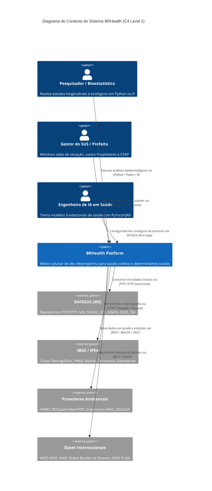
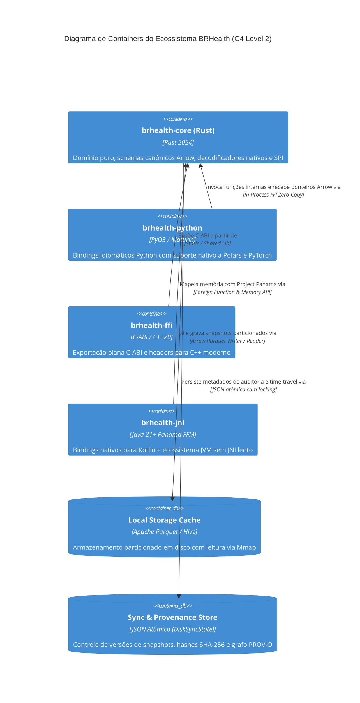

# BRHealth: Software Design Description (SDD)
## Documento de Especificação Arquitetural e Design de Sistema

**Document ID:** SDD-BRHEALTH-001  
**Versão:** 1.0.0-Draft  
**Data:** 2026-09-09  
**Autor Principal e Arquiteto:** Marcel (`MarcelDevBr`)  
**Licença:** GNU Affero General Public License v3 (AGPL-3.0-or-later) / Commercial Dual-Licensing  
**Status:** Aprovado para Implementação  

---

## Sumário

1. [Introdução e Objetivos do Sistema](#1-introdução-e-objetivos-do-sistema)
2. [Arquitetura Geral e Modelo C4](#2-arquitetura-geral-e-modelo-c4)
   - [2.1 Nível 1: Diagrama de Contexto](#21-nível-1-diagrama-de-contexto)
   - [2.2 Nível 2: Diagrama de Containers](#22-nível-2-diagrama-de-containers)
   - [2.3 Nível 3: Diagrama de Componentes (Hexagonal DOD)](#23-nível-3-diagrama-de-componentes-hexagonal-dod)
3. [Design de Domínio e Contratos SPI](#3-design-de-domínio-e-contratos-spi)
   - [3.1 Trait HealthDataSourceSPI](#31-trait-healthdatasourcespi)
   - [3.2 Gerenciamento de Country Packs](#32-gerenciamento-de-country-packs)
   - [3.3 Schemas Canônicos Apache Arrow](#33-schemas-canônicos-apache-arrow)
4. [Módulos de Desempenho Crítico e Algoritmos](#4-módulos-de-desempenho-crítico-e-algoritmos)
   - [4.1 Descompressor Blast Nativo em Rust (PKWARE DCL)](#41-descompressor-blast-nativo-em-rust-pkware-dcl)
   - [4.2 Harmonizador Territorial do IBGE (Algoritmo Módulo 10 Luhn)](#42-harmonizador-territorial-do-ibge-algoritmo-módulo-10-luhn)
   - [4.3 Indexação Espacial Discreta H3/S2](#43-indexação-espacial-discreta-h3s2)
   - [4.4 Interoperabilidade Zero-Copy e DLPack](#44-interoperabilidade-zero-copy-e-dlpack)
5. [Governança Científica e Princípios FAIR](#5-governança-científica-e-princípios-fair)
   - [5.1 Modelo de Linhagem W3C PROV-O](#51-modelo-de-linhagem-w3c-prov-o)
   - [5.2 Time-Travel e Snapshots Determinísticos](#52-time-travel-e-snapshots-determinísticos)
6. [Módulo de Economia da Saúde e Vigilância (CSAP)](#6-módulo-de-economia-da-saúde-e-vigilância-csap)
7. [Estrutura do Cargo Workspace e Engenharia de Build](#7-estrutura-do-cargo-workspace-e-engenharia-de-build)

---

## 1. Introdução e Objetivos do Sistema

O **BRHealth** é um motor analítico colunar de alta performance desenvolvido em Rust para ingestão, decodificação, harmonização e consulta de dados massivos de saúde pública, determinantes sociais e saúde planetária.

### 1.1 Objetivos de Engenharia
- **Throughput Máximo:** Processamento de coortes populacionais nacionais (centenas de milhões de registros) em segundos, através de memória contígua Apache Arrow, vetorização SIMD (AVX-512, ARM Neon) e paralelismo de dados Rayon.
- **Independência de Binários Legados:** Eliminação total de wrappers C externos para arquivos `.dbc` do DATASUS através de um descompressor PKWARE DCL puro em Rust.
- **Zero-Copy Cross-Language:** Exportação direta para ecossistemas analíticos (Polars, PyTorch, DuckDB, C++20, Java 21+ Project Panama) via Arrow C Data Interface e DLPack.
- **Rigor FAIR e Reprodutibilidade:** Emissão automática de grafos de linhagem W3C PROV-O com hash criptográfico SHA-256 no voo.

---

## 2. Arquitetura Geral e Modelo C4

### 2.1 Nível 1: Diagrama de Contexto



### 2.2 Nível 2: Diagrama de Containers



### 2.3 Nível 3: Diagrama de Componentes (Hexagonal DOD)

```mermaid
flowchart TD
    subgraph DrivingAdapters["Driving Adapters (Inbound)"]
        pyAdapter["PyO3 Engine Wrapper"]
        ffiAdapter["C-ABI Export Functions"]
        panamaAdapter["Java FFM Bridge"]
    end

    subgraph InboundPorts["Inbound Ports (Application Services)"]
        queryPort["MultidimensionalQueryPort"]
        spatialPort["SpatialJoinEnginePort"]
        provPort["ProvenanceExtractionPort"]
        timeTravelPort["SnapshotTimeTravelPort"]
        csapPort["CSAPCostAnalysisPort"]
    end

    subgraph DomainKernel["Domain Kernel (Rust Puro)"]
        canonicalSchemas["Canonical Arrow Schemas"]
        spiRegistry["Source Registry & Pack Manager"]
        ibgeHarmonizer["IBGE Luhn Mod10 SIMD Harmonizer"]
        cidMapper["CID-10 / CID-11 / SNOMED Cross-Mapper"]
        h3Indexer["Uber H3 / S2 Grid Indexer"]
        provEmitter["W3C PROV-O Manifest Generator"]
    end

    subgraph SourceSPI["Outbound Ports / HealthDataSourceSPI"]
        spiContract["HealthDataSourceSPI Trait"]
        transportContract["TransportPort"]
        decompressContract["DecompressorPort"]
        decoderContract["TabularDecoderPort"]
        cacheContract["LocalCachePort"]
    end

    subgraph DrivenAdapters["Driven Adapters (Infraestrutura)"]
        blastDecoder["Native Blast PKWARE DCL Decompressor"]
        dbfDecoder["Fast DBF to Arrow RecordBatch"]
        tokioFtp["Resilient Tokio FTP Client"]
        tokioHttp["Tokio HTTP Streaming Client"]
        hiveCache["Hive-Parquet Memory-Mapped Cache"]
        packBR["Country Pack Brasil (SIM, SIH, SINAN, IBGE)"]
        packGlobal["Country Pack Global (WHO, ERA5, WorldPop)"]
    end

    DrivingAdapters --> InboundPorts
    InboundPorts --> DomainKernel
    DomainKernel --> SourceSPI
    SourceSPI --> DrivenAdapters
```



---

## 3. Design de Domínio e Contratos SPI

### 3.1 Trait HealthDataSourceSPI

Toda fonte de dados implementa o contrato desacoplado `HealthDataSourceSPI`:

```rust
#[async_trait]
pub trait HealthDataSourceSPI: Send + Sync {
    fn metadata(&self) -> SourceMetadata;
    fn target_schema(&self) -> Arc<Schema>;
    fn resolve_locator(&self, params: &DataQueryParams) -> Result<SourceLocator, PortError>;
    async fn fetch_and_decode(
        &self,
        locator: &SourceLocator,
        context: &SourceExecutionContext,
    ) -> Result<Vec<RecordBatch>, PortError>;
}
```

### 3.2 Schemas Canônicos Apache Arrow

Os schemas canônicos definem a estrutura formal unificada para cada domínio temático:

#### 1. Estatísticas Vitais (Mortalidade - SIM)
- `record_id`: Utf8 (não nulo)
- `country_iso3`: Utf8 ("BRA")
- `jurisdiction_code`: Utf8 (Código canônico do município de 7 dígitos)
- `h3_index_res8`: UInt64 (Célula espacial discreta H3)
- `event_date`: Date32 (Data do óbito)
- `underlying_cause_icd10`: Utf8 (Causa básica CID-10 validada)
- `underlying_cause_icd11`: Utf8 (Causa mapeada CID-11)
- `age_years`: UInt16 (Idade calculada em anos)
- `sex`: Utf8 ("M", "F", "U")
- `race_ethnicity`: Utf8 (Raça/cor padronizada IBGE)
- `maternal_death`: Boolean (Indicador de morte materna)

#### 2. Morbidade Hospitalar (SIHSUS - RD/AIH)
- `aih_number`: Utf8
- `municipality_residence`: Utf8 (7 dígitos)
- `municipality_hospital`: Utf8 (7 dígitos)
- `admission_date`: Date32
- `discharge_date`: Date32
- `length_of_stay_days`: UInt16
- `main_diagnosis_icd10`: Utf8
- `secondary_diagnosis_icd10`: Utf8
- `procedure_sigtap`: Utf8 (Código SIGTAP de 10 dígitos)
- `total_paid_amount`: Float64 (Valor total pago na AIH)
- `icu_days`: UInt16 (Dias em UTI)
- `death_outcome`: Boolean (Desfecho em óbito)
- `is_csap`: Boolean (Indicador de Condição Sensível à Atenção Primária)

---

## 4. Módulos de Desempenho Crítico e Algoritmos

### 4.1 Descompressor Blast Nativo em Rust (PKWARE DCL)

Os arquivos `.dbc` do DATASUS utilizam o algoritmo **PKWARE Data Compression Library (DCL)**, baseado em codificação canônica de Huffman com janela circular deslizante de 4096 bytes:

```text
Entrada Binária (.dbc)
  │
  ▼
BitReader (Leitura de bits em streaming)
  │
  ├─► Bit = 0: Byte Literal (8 bits diretos) ──► Janela Deslizante (4096B) ──► Buffer de Saída
  │
  └─► Bit = 1: Sequência Repetida
        ├─► Decodifica Símbolo de Tamanho (Huffman) + Bits Extras
        ├─► Decodifica Símbolo de Distância (Huffman) + Bits Extras
        └─► Cópia Circular do Dicionário (Zero-Allocation) ──► Buffer de Saída
```

A implementação opera inteiramente em memória contígua com bounds-checking seguro do Rust, eliminando riscos de buffer overflow presentes em códigos C legados.

### 4.2 Harmonizador Territorial do IBGE (Algoritmo Módulo 10 Luhn)

A transformação de códigos municipais legados de 6 dígitos para o padrão canônico de 7 dígitos do IBGE é calculada matematicamente:

Seja $D = [d_1, d_2, d_3, d_4, d_5, d_6]$ e $W = [1, 2, 1, 2, 1, 2]$:
1. $p_i = d_i \times w_i$
2. $s_i = \lfloor p_i / 10 \rfloor + (p_i \pmod{10})$
3. $S = \sum_{i=1}^{6} s_i$
4. $R = S \pmod{10}$
5. $\text{DV} = (10 - R) \pmod{10}$

O motor contém tabelas estáticas mapeadas em tempo de compilação para reconciliar municípios criados por emancipação e desmembramentos territoriais entre 1970 e 2026.

### 4.3 Indexação Espacial Discreta H3/S2

Substituição de intersecções geométricas pesadas (polígonos GIS) por chaves discretas inteiras de 64 bits (`uint64`):
- Resolução H3 7 (~1,2 km de raio médio): Adequada para análises municipais e climatológicas.
- Resolução H3 8 (~460 m de raio médio): Ideal para vigilância epidemiológica intraurbana e identificação de clusters residenciais de arboviroses.

---

## 5. Governança Científica e Princípios FAIR

### 5.1 Modelo de Linhagem W3C PROV-O

Todo lote processado grava um arquivo colateral `<dataset>.prov.json` estruturado no padrão W3C PROV:
- **`wasGeneratedBy`**: Identificador da execução analítica com UUIDv4 e carimbo UTC.
- **`used`**: URIs exatas das fontes primárias do DATASUS/IBGE acompanhadas dos respectivos hashes SHA-256 brutos.
- **`wasAssociatedWith`**: Versão do `brhealth-core`, commit hash do repositório Git e extensões SIMD ativas na compilação.

### 5.2 Time-Travel e Snapshots Determinísticos

Para garantir reprodutibilidade perante retificações tardias do DATASUS, cada partição no cache local Hive-Parquet é identificada pelo timestamp de ingestão:
`sih_sp_2024_snap20240401.parquet` vs `sih_sp_2024_snap20240815.parquet`. O usuário pode congelar explicitamente o snapshot de análise via parâmetro `as_of_snapshot`.

---

## 6. Módulo de Economia da Saúde e Vigilância (CSAP)

Implementação nativa dos critérios da **Portaria MS/SAS nº 221/2008**:
- 19 grupos diagnósticos de CSAP (doenças preveníveis por imunização, gastroenterites infecciosas, anemia, deficiências nutricionais, infecções de ouvido/nariz/garganta, pneumonias bacterianas, asma, doenças pulmonares, hipertensão, angina, insuficiência cardíaca, doenças cerebrovasculares, diabetes mellitus, epilepsias, infecção do trato urinário, infecções de pele, doença inflamatória pélvica feminina, úlcera gastrointestinal e doenças relacionadas ao pré-natal).
- Cálculo automatizado de:
  - Custo hospitalar direto evitável ($\sum \text{VAL\_TOT}$).
  - Diárias de leito hospitalar ocupadas por causas evitáveis.
  - Taxas de amputação de membros inferiores por diabetes descompensado (`PROC_REA` SIGTAP).
  - Projeção de Retorno sobre Investimento (ROI) com fortalecimento da Estratégia Saúde da Família (ESF).

---

## 7. Estrutura do Cargo Workspace e Engenharia de Build

### Estrutura de Diretórios do Workspace
```text
brhealth/
├── Cargo.toml                         # Workspace raiz e perfis LTO
├── docs/architecture/                 # Especificações arquiteturais e SDD
├── bindings/
│   ├── cpp/include/brhealth.hpp       # Header C++20 RAII
│   └── jvm/BRHealthEngine.java        # Interface Java 21 Panama FFM
├── crates/
│   ├── brhealth-core/                 # Domínio Puro, Inbound/Outbound Ports, SPI e 26 Fontes Oficiais
│   │   ├── Cargo.toml
│   │   └── src/
│   │       ├── domain/
│   │       │   ├── application.rs     # BRHealthApplicationService
│   │       │   ├── declarative.rs     # Dynamic Declarative YAML/JSON Data Source Loader
│   │       │   ├── provenance.rs      # FAIR W3C PROV-O & SHA-256 Hashing
│   │       │   ├── registry.rs        # Source Registry & Pack Manager
│   │       │   ├── analytics/
│   │       │   │   ├── csap.rs        # CSAP Portaria 221/2008 & Primary Care ROI
│   │       │   │   └── mortality.rs   # APVP / YLL & Age-Standardized Rates
│   │       │   ├── spatial/
│   │       │   │   ├── h3.rs          # Uber H3 Hexagonal Discrete Indexing
│   │       │   │   ├── s2.rs          # Google S2 Geometry Discrete Indexing
│   │       │   │   └── join.rs        # Columnar Vectorized Spatial Joins
│   │       │   ├── transforms/
│   │       │   │   ├── ibge.rs        # Luhn Modulo 10 DV & Transições 1970-2026
│   │       │   │   ├── ontology.rs    # CID-9 <-> CID-10 <-> CID-11, SNOMED & Consistência
│   │       │   │   ├── sigtap.rs      # SUS SIGTAP 10 Dígitos & Eventos Sentinela
│   │       │   │   └── pharmacy.rs    # OMS ATC & RxNorm Active Ingredient Mapping
│   │       │   └── ports/
│   │       │       ├── inbound.rs     # Driving Ports (Query, Spatial, Prov, CSAP, etc.)
│   │       │       └── outbound.rs    # Outbound SPI Traits
│   │       ├── decoders/
│   │       │   ├── blast/             # Descompressor Nativo PKWARE DCL (.dbc)
│   │       │   ├── dbf/               # Fast DBF para Arrow RecordBatch
│   │       │   ├── geoarrow.rs        # Apache GeoArrow Points
│   │       │   └── netcdf.rs          # Matrizes Climáticas em Grade
│   │       ├── infrastructure/
│   │       │   ├── transport/         # Tokio FTP DATASUS, HTTP Streaming, Local File
│   │       │   ├── state/             # Disk Sync State (Auditoria JSON Atômica com Locking)
│   │       │   └── storage/           # Hive-Parquet Cache com Time-Travel
│   │       └── sources/               # 26 Fontes Oficiais (20 Brasil + 6 Global)
│   ├── brhealth-cli/                  # CLI Nativo de Alta Performance (Subcomandos analíticos)
│   ├── brhealth-ffi/                  # C-ABI plana e Arrow C Data Interface
│   ├── brhealth-python/               # Bindings PyO3 com DLPack e Acessores Semânticos
│   └── brhealth-jni/                  # Bindings Java 21+ Project Panama FFM
└── .agents/
    ├── rules/
    └── skills/
```

### Otimizações do Compilador em Release
```toml
[profile.release]
opt-level = 3
lto = "fat"
codegen-units = 1
panic = "abort"
strip = "symbols"
```
